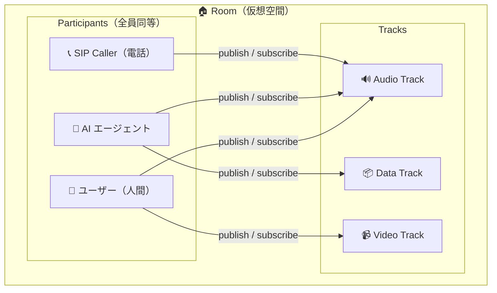

# LiveKit Basics Overview

参照元: [[SourceNotes/LiveKit_Agents_Documentation.md|LiveKit Agents Documentation]]
ロードマップ: [[StructureNotes/LiveKit_Agent_Framework_学習ロードマップ.md|学習ロードマップ]]

## 一言まとめ

LiveKit は「Room という仮想空間に Participant が集まって Track を交換する」プラットフォーム。
AI エージェントも人間も同じ Participant として扱われるのが設計思想の核心。

## Room

- 通信が行われる仮想空間
- 設定できる項目: **最大参加人数 (max participants)**、**空室タイムアウト (empty timeout)**（全員退出後に自動削除するまでの時間）
- サーバーサイドから CRUD 操作（作成・一覧・削除）が可能 → プログラムから Room を管理できる

## Participant

Room に参加するエンティティ。以下が全て同じ Participant として扱われる：
- フロントエンドアプリのユーザー（人間）
- AI エージェント
- **SIP caller（電話ユーザー）**
- その他 LiveKit に接続するあらゆるサービス

### SIP とは？
SIP = Session Initiation Protocol。電話（固定電話・IP電話）の通話プロトコル。
LiveKit は WebRTC だけでなく電話回線とも接続できる。
→ 「電話で問い合わせ対応する音声エージェント」のようなユースケースが実現できる理由。

各 Participant は identity を持ち、Track の publish/subscribe が可能。
操作: 一覧取得・削除・ミュートができる。

## Track

Participant 間を流れるメディアストリーム。3種類ある：

| 種類 | 内容 |
|---|---|
| Audio Track | 音声ストリーム |
| Video Track | 映像ストリーム |
| **Data Track** | 任意のデータ（テキスト・JSON・バイナリなど） |

- **publish** = 送信（自分のメディアを Room に流す）
- **subscribe** = 受信（他の Participant のメディアを受け取る）
- 1つの Participant が複数 Track を同時に publish できる

### Data Track の用途例
- 音声エージェントがリアルタイム字幕データを流す
- ユーザーのアクション情報をエージェントに伝える
- 音声以外のチャネルで情報を補完する

## Webhooks & Events

Room・Participant・Track の変化を監視・検知する仕組みとして Webhooks/Events が使える。
