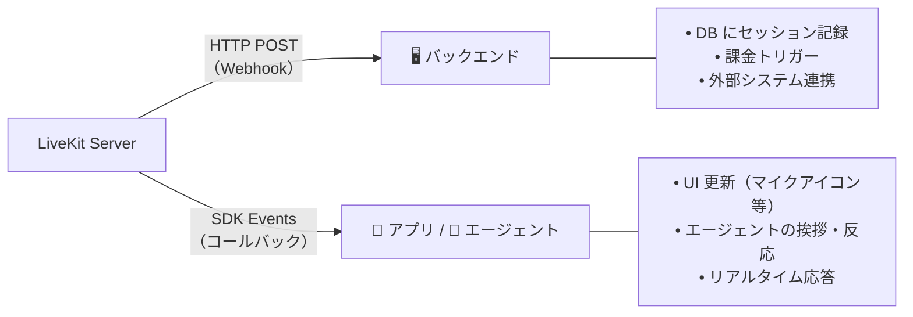
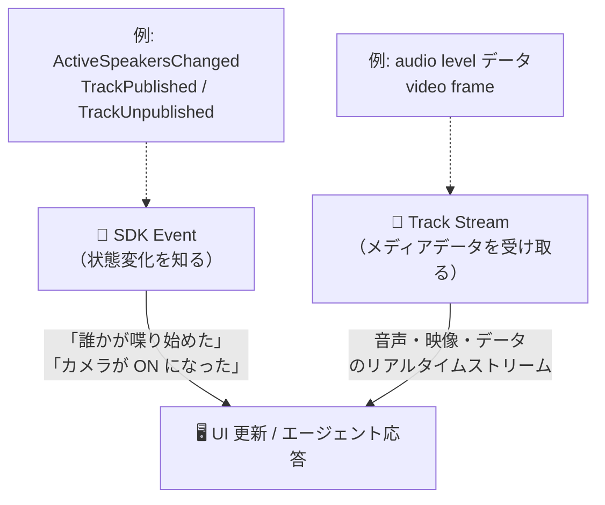
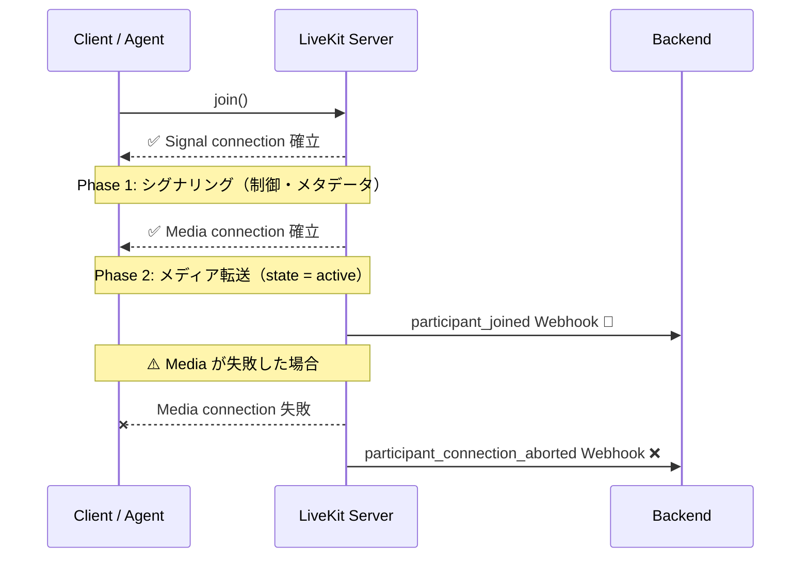

# Webhooks and Events

参照元: [[SourceNotes/LiveKit Agents Documentation.md|LiveKit Agents Documentation]]
ロードマップ: [[StructureNotes/LiveKit_Agent_Framework_学習ロードマップ.md|学習ロードマップ]]

## 一言まとめ

**SDK Events** = 状態変化の通知（何かが変わったことを知る）
**Track Stream** = ストリーミング情報のリアルタイム描画・対応（実際のメディアデータを受け取る）
**Webhook** = バックエンドへのサーバーサイド通知

## Webhook vs SDK Events

| | Webhook | SDK Events |
|---|---|---|
| 向き | LiveKit → **バックエンド**（HTTP POST） | LiveKit SDK → **アプリ・エージェント内** |
| 用途 | ビジネスロジック・ログ・外部システム連携 | リアルタイム UI 更新・エージェントの反応 |
| 具体例 | セッション開始をDBに記録、課金トリガー | マイクアイコンの切り替え、エージェントの挨拶 |

**エージェント開発では SDK Events を大量に使う。**

## SDK Events + Track Stream の使い分け

LiveKit フロントエンドのインタラクティブな表示はこの2層で動く：

**具体例：音波形アニメーション**
- SDK Event `ActiveSpeakersChanged` で「Aさんが喋っている」を検知
- Audio Track の audio level データをリアルタイムで読んで波形を描画

**具体例：顔映像の表示**
- SDK Event `TrackPublished` で「Bさんのカメラが ON になった」を検知
- Video Track のフレームをそのままレンダリング

## 接続の2フェーズ

Participant が Room に join するとき、接続は2段階：

1. **Signal connection** — シグナリングチャネル確立（メタデータ・制御メッセージ）
2. **Media connection** — 実際のメディア転送チャネル確立

Signal だけ繋がっても Media が失敗するケースがある（`participant_connection_aborted`）。
`participant_joined` Webhook は **Media connection 確立後（state = active）**に発火する。

## Webhook Events 一覧

| イベント | タイミング |
|---|---|
| `room_started` | 最初の Participant が join して Room が始まったとき |
| `room_finished` | 最後の退出 → empty timeout 経過 → Room クローズ |
| `participant_joined` | Media connection 確立後（state = active） |
| `participant_left` | 退出 & 全クリーンアップ完了後 |
| `participant_connection_aborted` | Signal は繋がったが Media が失敗したとき |
| `track_published` | Track が publish されたとき（payload の room/participant は SID・name・identity のみ） |
| `track_unpublished` | Track が unpublish されたとき |
| `egress_started` | 録画・配信（Egress）開始 |
| `egress_updated` | Egress 状態更新（例: 録画ファイルサイズ変化） |
| `egress_ended` | Egress 終了 |
| `ingress_started` | 外部メディア取り込み（Ingress）開始 |
| `ingress_ended` | Ingress 終了 |

## SDK Events の種類

Room events と Participant events の2種類。
**Room events は Participant events のスーパーセット**（Room 全体＋個別 Participant 両方受け取れる）。

→ UI コンポーネントを「この Participant だけ監視」する粒度で設計できる。

## Webhook の信頼性

- HTTP POST で配信。**配信保証はない**（best-effort）
- 失敗時はリトライあり。複数イベントが溜まった場合は順序を保ってから届ける
- Authorization ヘッダーに署名済み JWT が含まれる（正規 LiveKit からのリクエストか検証可能）
