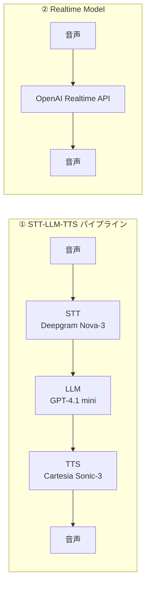
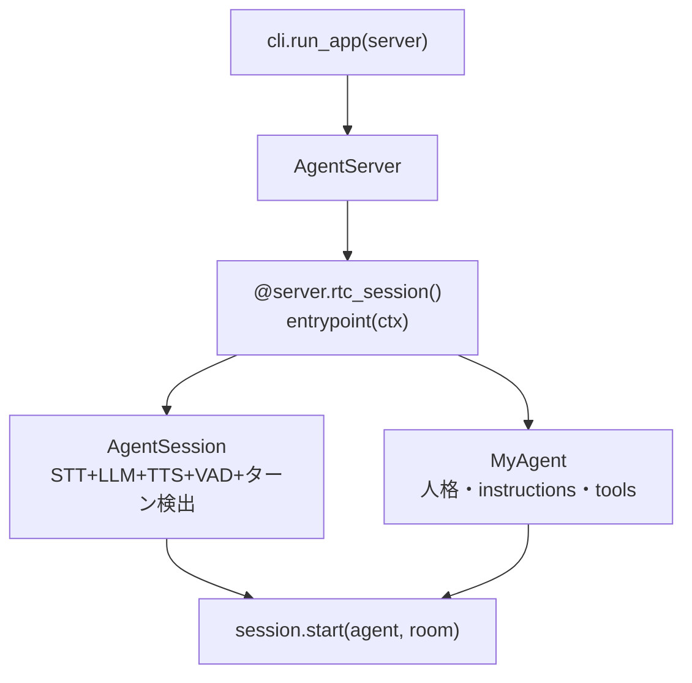
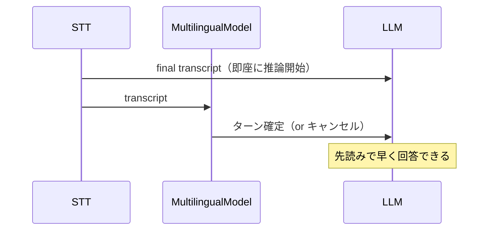
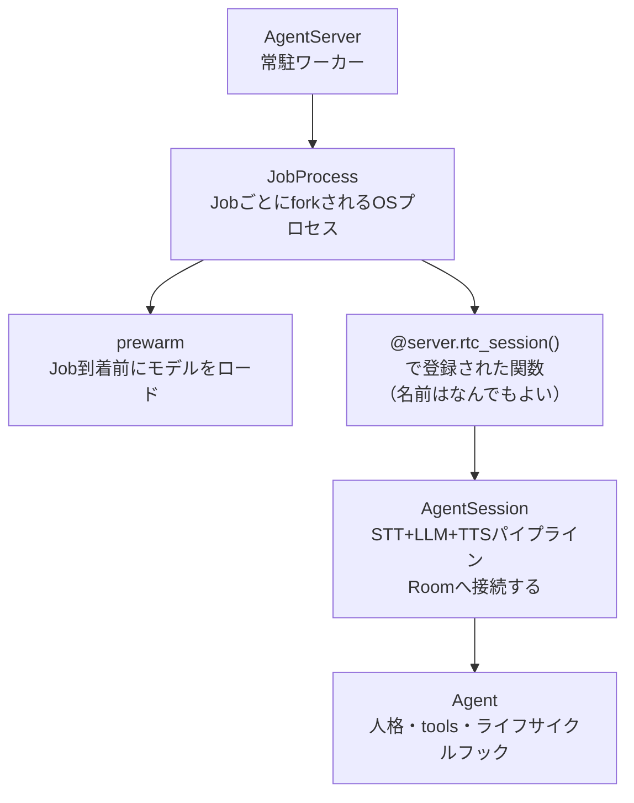

# Voice AI Quickstart

参照元: [[SourceNotes/LiveKit_Agents_Documentation.md|LiveKit Agents Documentation]]
ロードマップ: [[StructureNotes/LiveKit_Agent_Framework_学習ロードマップ.md|学習ロードマップ]]

ドキュメント: https://docs.livekit.io/agents/start/voice-ai-quickstart/
コード参照: https://github.com/livekit/agents/blob/main/examples/voice_agents/basic_agent.py
スターターテンプレート: https://github.com/livekit-examples/agent-starter-python

## What（何についてか）

LiveKit Agentsを使ったvoiceエージェントの最小構成と、実際に動かすまでのセットアップ手順。

## Why（なぜ必要か）

「動くものを先に作る」ことで全体のアーキテクチャを肌で理解するための出発点。

## How（どう動くか）

### 2種類のモデル構成



| | STT-LLM-TTS | Realtime Model |
|---|---|---|
| **制御性** | ✅ 高い（各ステップに介入可能） | ❌ 低い |
| **Transcription** | ✅ 自然に取れる | ❌ 難しい |
| **レイテンシ** | ❌ 3段階分のオーバーヘッド | ✅ 速い |
| **コスト** | ✅ 安い | ❌ 高い |
| **プロバイダ選択** | ✅ 自由（Deepgram/ElevenLabs等） | ❌ 限定的 |

### コードの構造



**`MyAgent`（人格・ツール）**
- `Agent` を継承して定義
- `instructions` → LLMへのシステムプロンプト
- `on_enter()` → セッション参加時のライフサイクルフック（ここで初回発話）
- `@function_tool` → LLMが呼べるツール（Function Calling）を1アノテーションで登録

**`AgentServer` + `prewarm`**
- `prewarm` → Jobが来る前にプロセスをウォームアップ。Silero VADのような重いモデルを事前ロードしてレイテンシを削減
- `@server.rtc_session()` → WebRTCセッションが来た時に呼ばれる関数を登録

**`AgentSession`（パイプラインの心臓部）**

```python
session = AgentSession(
    stt=inference.STT("deepgram/nova-3", language="multi"),
    llm=inference.LLM("openai/gpt-4.1-mini"),
    tts=inference.TTS("cartesia/sonic-3", voice="..."),
    turn_detection=MultilingualModel(),
    vad=ctx.proc.userdata["vad"],
    preemptive_generation=True,
    resume_false_interruption=True,
    false_interruption_timeout=1.0,
    aec_warmup_duration=3.0,
)
```

### ターン検出の仕組み


**MultilingualModel（LivKit謹製オープンウェイト）:**
- VADの「無音検知」だけでなく、**テキストの意味・文脈**でターン完了を判定
- 「えーっと…」の息継ぎで割り込まなくなる
- 多言語対応（日本語含む）
- VADのみより精度高、STT endpointingより汎用的

| 手法 | 判定根拠 | 精度 | 備考 |
|---|---|---|---|
| VAD only | 無音の長さ | 低い | 息継ぎで誤検知 |
| STT endpointing | 句読点・文末 | 中 | プロバイダ依存 |
| MultilingualModel | 意味・文脈 | 高い | LivKit推奨 |

### 重要パラメータ詳細

**`preemptive_generation=True`**
- STTのfinalトランスクリプトが出た時点でLLM推論を開始（ターン確定を待たない）
- turn_detection（MultilingualModel）と組み合わせて初めて真価を発揮
- コスト：通常フローは同じ。キャンセル多発時のみ微増（途中生成トークンが無駄になる）



**`resume_false_interruption=True` / `false_interruption_timeout=1.0`**
- 背景ノイズ等でVADが誤検知 → エージェントの発話が止まる問題への対策
- 1秒間STTでテキストが出なければ「誤検知」と判断 → 発話を再開

**`aec_warmup_duration=3.0`**
- AEC（音響エコーキャンセル）= エージェントの声がマイクに拾われることを防ぐ機能
- セッション開始直後はキャリブレーション中のため、3秒間は割り込み検知をブロック
- ⚠️ **v1.4.3（2026-03-01時点の最新）には存在しない。** main ブランチで追加されたばかりでまだ未リリース。v1.4.3 では使用しないこと。

### 3つの起動モード

| モード | 用途 |
|---|---|
| `console` | ターミナル内で会話。ローカルテスト向け |
| `dev` | LiveKit Cloudに接続、ブラウザ等からアクセス可能 |
| `start` | 本番モード |

### クラスの構造的な関係



| クラス | 役割 | 備考 |
|---|---|---|
| `JobProcess` | Jobを隔離するOSプロセス | クラッシュが他Jobに波及しない |
| `JobContext` | Job実行時の情報コンテナ | `ctx.room` / `ctx.proc` を持つ |
| `AgentSession` | STT+LLM+TTSパイプライン、Roomに接続 | **関数本体で自分でnewする** |
| `Agent` | 人格・tools・ライフサイクルフック | `session.start()` に渡す |

- **JobProcess** はOSレベルの境界。Roomに参加するのはAgentSession
- **`ctx.proc`** = JobProcess（`prewarm`でロードしたモデルを `ctx.proc.userdata["vad"]` で取り出せる）

### デコレータと関数の役割分担

```python
@server.rtc_session(agent_name="my-agent")   # ← 登録するだけ
async def my_agent(ctx: JobContext):          # ← 関数名は何でもよい（"entrypoint"は慣習）
    session = AgentSession(...)               # ← AgentSessionを作るのは自分のコード
    await session.start(agent=Assistant(), room=ctx.room)
    await ctx.connect()                       # ← 明示的接続（スターターのみ）
```

- **デコレータ** = 「Jobが来たらこの関数を呼べ」と登録するだけ。AgentSessionは作らない
- **関数本体** = 自分でAgentSessionをnewして、session.start()で動かす
- **`entrypoint`** = ただの慣習的な名前。`my_agent` でも `handle_session` でも動く
- **`agent_name`** = Agent Dispatchで特定のAgentを指名する時に使う名前（省略可）
- **`await ctx.connect()`** = スターターは明示的に呼ぶ。`basic_agent.py` はAgentSessionのauto-connectに任せる

## Key Concepts

| 用語 | 説明 |
|---|---|
| VAD | Voice Activity Detection。音声の有無を検知するローカルMLモデル |
| MultilingualModel | LiveKit謹製のターン検出モデル。意味・文脈でターン完了を判定 |
| prewarm | Job到着前にプロセスを起動し重いモデルを事前ロードする仕組み |
| preemptive_generation | STT final時点でLLM推論を先読み開始してレイテンシを削減 |
| AEC | Acoustic Echo Cancellation。エージェントの声がマイクに拾われるのを防ぐ（`aec_warmup_duration` は v1.4.3 未実装） |
| false interruption | 背景ノイズ等でVADが誤ってユーザー発話と検知すること |
| JobProcess | Jobを隔離するOSプロセス。prewarmで事前起動 |
| JobContext | Job実行時の情報コンテナ（room / proc を持つ） |
| agent_name | rtc_session()のパラメータ。Agent Dispatchで特定Agentを指名する時に使う |

## 一言まとめ

`MyAgent`が人格・ツール、`AgentSession`がSTT→LLM→TTSパイプライン、`AgentServer`がWebRTCでRoomに繋ぐ。ターン検出はVADで音を検知し、MultilingualModelで意味的に確定させる2段構え。デコレータは「Jobが来たらこの関数を呼べ」と登録するだけで、AgentSessionを作るのは関数本体の自分のコード。
