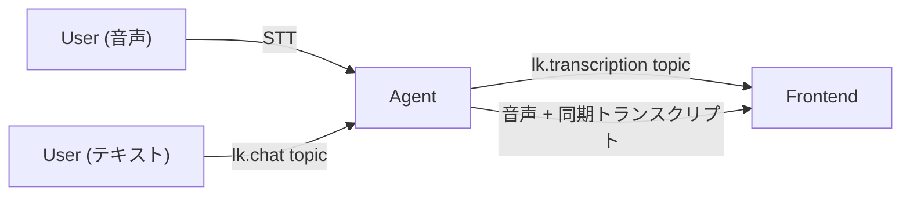

# Text and Transcriptions

参照元: [[SourceNotes/LiveKit_Agents_Documentation.md|LiveKit Agents Documentation]]
ロードマップ: [[StructureNotes/LiveKit_Agent_Framework_学習ロードマップ.md|学習ロードマップ]]
上位ノート: [[LiteratureNotes/lit-202602282303-pgqv.md|Agents Framework Introduction]]

## What（何についてか）

LiveKit Agentsにおけるテキスト入出力とトランスクリプション機能。音声に加えてテキストチャンネルを扱う仕組み。

## Why（なぜ必要か）

- 音声だけでは「話したくない」「字幕が欲しい」「ログを残したい」ニーズを満たせない
- テキスト入力・トランスクリプション・テキストonly切り替えを組み合わせることで柔軟なUXが実現できる

## How（どう動くか）



### Transcription（音声→テキスト配信）

- AgentがSTTした内容をリアルタイムでフロントに流す
- Agentの発話テキストも音声に同期して配信（字幕）
- **デフォルトON**。`text_output=False` で無効化

**同期モード（デフォルト）:**
- 発話と文字がワード単位で同期。割り込まれたら文字も止まる
- フロントで「喋ってる内容がリアルタイムに表示される」UX

**即時モード（`sync_transcription=False`）:**
- 音声を待たずに確定次第すぐ配信
- 字幕同期より「テキストログとしてすぐ欲しい」場合向け

**単語レベル同期（TTS aligned）:**
- `use_tts_aligned_transcript=True` で有効化
- 現時点で対応TTS: **Cartesia** と **ElevenLabs** のみ
- 他プロバイダーは文レベルの同期どまり

### Text Input（テキスト入力）

- フロントから `sendText()` → `lk.chat` トピック経由でAgentに届く
- 音声会話中でも **割り込み扱い**（現在の発話を止めて処理し直す）
- `text_input=False` で無効化可能
- 手動トリガー: `session.generate_reply(user_input="...")`

### Text-only / ハイブリッドセッション

- `session.input.set_audio_enabled(False)` で音声入力をOFF
- `session.output.set_audio_enabled(False)` で音声出力をOFF
- セッション開始時に固定もできるし、動的に切り替えも可能
- フロントからの切り替えトリガーはおそらくRPC経由（要確認）

## Frontend（JS）

```js
// トランスクリプトストリームを受信
room.registerTextStreamHandler('lk.transcription', async (reader, participantInfo) => {
  for await (const chunk of reader) {
    console.log(chunk.text)
  }
})
```

- 1発話 = 2ストリーム: `interim_stream`（処理中）と `final_stream`（確定版）
- `lk.transcription_final: true` で確定版を判別
- React: `useTranscriptions()` フック

## Key Concepts

| 用語 | 説明 |
|---|---|
| `lk.transcription` | トランスクリプトが流れるテキストストリームトピック |
| `lk.chat` | テキスト入力が流れるトピック |
| `sync_transcription` | 音声と文字の同期ON/OFF |
| `use_tts_aligned_transcript` | 単語レベル同期の有効化フラグ |
| `SpeechHandle` | say()/generate_reply()の戻り値。発話状態の追跡に使う |

## 一言まとめ

音声会話の「テキスト版」を並走させる仕組み。デフォルトで同期字幕が流れ、テキスト入力も割り込みとして扱われる。音声とテキストの組み合わせを柔軟に制御できる。
