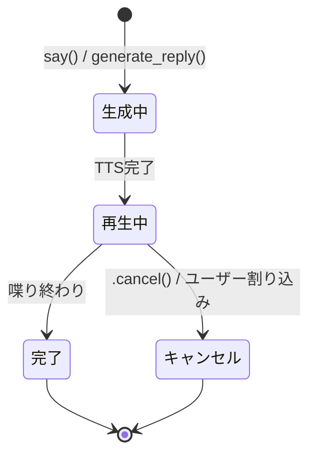

# Agent Speech and Audio

参照元: [[SourceNotes/LiveKit_Agents_Documentation.md|LiveKit Agents Documentation]]
ロードマップ: [[StructureNotes/LiveKit_Agent_Framework_学習ロードマップ.md|学習ロードマップ]]
上位ノート: [[LiteratureNotes/lit-202602282303-pgqv.md|Agents Framework Introduction]]

## What（何についてか）

LiveKit Agentsの音声機能。Agentが「いつ・どう喋るか」を制御する仕組み。

## Why（なぜ必要か）

- ユーザーが繋がる前から音声を取りこぼさないため（Instant Connect）
- 体感レイテンシを下げるため（Preemptive Generation）
- Agentからプロアクティブに喋らせたり、発話をプログラムで制御したいため

## コード全体構造

```python
class MyAgent(Agent):
    def __init__(self):
        super().__init__(instructions="...")

    @function_tool
    async def my_tool(self, context):
        session = context.session
        handle = await session.say("処理中です")
        await handle  # 完了待ち

@rtc_session
async def entrypoint(ctx: RunContext):
    session = AgentSession()

    @session.on("agent_state_changed")
    async def on_state(event):
        print(f"{event.old_state} → {event.new_state}")

    await session.start(agent=MyAgent(), room=ctx.room)
```

**書く場所の整理:**

| 処理の種類 | 書く場所 |
|---|---|
| AIのツール・機能 | `Agent` クラスの `@function_tool` |
| 状態監視・副作用 | `entrypoint` の `@session.on(...)` |
| セッション起動設定 | `entrypoint` の `session.start(...)` |

## How（どう動くか）

### Instant Connect（即時接続最適化）

- Agent接続確立前からマイク入力をバッファしておく
- 接続後に `lk.agent.pre-connect-audio-buffer` トピックで送信
- 「繋がった瞬間にユーザーが喋り始めてる」場合の取りこぼし防止
- Agentが先に喋るユースケースでは恩恵なし。それ以外は基本ON

### Preemptive Speech Generation（先読み応答）

- ユーザーの発話終了を待たずに、部分トランスクリプトで応答生成を先行スタート
- `preemptive_generation=True` で有効化
- レイテンシ改善の効果は保証なし（observabilityで要検証）

### session.say / generate_reply（能動的発話）

デフォルトはユーザー入力待ちだが、Agentから先に喋らせたい時に使う。

| メソッド | 推論 | コスト | 用途 |
|---|---|---|---|
| `session.say(audio=...)` | なし | 最安 | 事前合成音声を再生するだけ |
| `session.say(text=...)` | TTSのみ | 安い | 固定テキストをTTSで喋る |
| `session.generate_reply(instructions=...)` | LLM + TTS | 普通 | LLMに応答生成させて喋らせる |

**generate_reply の instructions vs user_input:**

```python
# instructions: Agentへの指示。チャット履歴に残らない
session.generate_reply(instructions="ユーザーに挨拶して名前を聞いて")

# user_input: ユーザーの発言として扱う。チャット履歴に残る
session.generate_reply(user_input="こんにちは")
```

### SpeechHandle（発話コントロール）

`say()` / `generate_reply()` の戻り値。発話の「チケット」。



**主な使い方:**

```python
# 完了待ち
handle = await session.say("処理完了しました")
await handle
await session.aclose()  # 喋り終わってから終了

# 割り込み検知（function_toolの中で書く）
@function_tool
async def fetch_data(self, context):
    session = context.session
    async with aiohttp.ClientSession() as http:
        web_request = http.get('https://api.example.com/data')
        handle = await session.generate_reply(
            instructions="処理中だと伝えて"
        )
        if handle.interrupted:
            web_request.cancel()  # ユーザーが気変わりしたのでキャンセル
        else:
            data = await web_request
            return str(data)

# コールバック登録
handle.add_done_callback(lambda f: print("完了"))

# 現在の発話を取得
current = session.current_speech  # None or SpeechHandle
if current:
    await current  # 今の発話が終わるまで待つ
```

**SpeechHandleのプロパティ:**

| プロパティ/メソッド | 説明 |
|---|---|
| `await handle` | 発話完了まで待つ |
| `handle.interrupted` | ユーザーに割り込まれたか（bool） |
| `handle.cancel()` | 発話を強制停止 |
| `handle.add_done_callback(fn)` | 完了時コールバック登録 |
| `session.current_speech` | アクティブなSpeechHandle（なければNone） |

### speech_created イベント

```python
@session.on("speech_created")
async def on_speech(event):
    print(event.source)        # "say" / "generate_reply" / "tool_response"
    print(event.user_initiated)  # True = 手動トリガー
    handle = event.speech_handle
```

### Background Audio（背景音）

```python
from livekit.agents import BackgroundAudioPlayer, BuiltinAudioClip

player = BackgroundAudioPlayer(
    ambient_sound=BuiltinAudioClip.OFFICE_AMBIENCE,  # ループ環境音
    thinking_sound=BuiltinAudioClip.KEYBOARD_TYPING,  # LLM処理中の音
)
await player.start(room=ctx.room, agent_session=session)
await player.play("path/to/effect.mp3")  # 任意のタイミングで効果音
```

### tts_node とは（Node概念の入門）

パイプラインの流れ：

```
ユーザーの声
  ↓
[ stt_node ]  ← 音声→テキスト
  ↓
[ llm_node ]  ← テキスト→応答生成
  ↓
[ tts_node ]  ← テキスト→音声（ここで加工できる）
  ↓
ユーザーに返す
```

`tts_node` = LLMが生成したテキストをTTSに渡す直前の割り込みポイント。
`Agent`クラスのメソッドとしてオーバーライドして使う。

> 詳細はPhase 4「Pipeline Nodes & Hooks」で扱う。今は「パイプラインの途中で割り込める場所」とだけ覚えておく。

### Customizing Pronunciation（発音カスタマイズ）

SSML（Speech Synthesis Markup Language）を `tts_node` 内で挿入して発音を制御する：

```python
class MyAgent(Agent):
    async def tts_node(self, text, model_settings):
        ssml_text = """
            <phoneme alphabet="ipa" ph="ˈlaɪvkɪt">LiveKit</phoneme>の
            <emphasis level="strong">最新バージョン</emphasis>は
            <break time="500ms"/>
            <prosody rate="slow">とても重要です</prosody>
        """
        async for chunk in super().tts_node(ssml_text, model_settings):
            yield chunk
```

**SSMLタグ一覧：**

| タグ | 用途 |
|---|---|
| `<phoneme>` | 発音記号で読み方を指定 |
| `<say-as interpret-as="characters">` | 1文字ずつ読む等、解釈方法を指定 |
| `<emphasis>` | 強調して読む |
| `<break time="500ms"/>` | ポーズを挿入 |
| `<prosody rate/pitch/volume>` | 速度・ピッチ・音量を制御 |
| `<lexicon>` | カスタム辞書で発音を一括定義 |

### Adjusting Speech Volume（音量調整）

**方法A: Agent側（tts_node）でゲインをかける**
全クライアントに同じ音量を送りたい場合。ツールで動的制御も可能：

```python
class MyAgent(Agent):
    def __init__(self):
        super().__init__(instructions="...")
        self._volume = 50  # 0〜100

    @function_tool
    async def set_volume(self, context, volume: int):
        """音量を設定する (0-100)"""
        self._volume = max(0, min(100, volume))
        return f"音量を {self._volume} に設定しました"

    async def tts_node(self, text, model_settings):
        gain = self._volume / 100.0
        async for chunk in super().tts_node(text, model_settings):
            yield chunk * gain  # フレームに倍率をかける
```

**方法B: フロントエンド側で調整**
クライアントごとに音量を変えたい場合：

```js
participant.audioTracks.forEach(track => {
    track.setVolume(0.8)  // 0.0〜1.0
})
```

## Key Concepts

| 用語 | 説明 |
|---|---|
| `SpeechHandle` | say()/generate_reply()の戻り値。発話の状態追跡・制御に使う |
| `handle.interrupted` | ユーザーに割り込まれたかのフラグ |
| `session.current_speech` | 現在アクティブなSpeechHandle |
| `BackgroundAudioPlayer` | 環境音・効果音の管理クラス |
| `preemptive_generation` | 先読み応答の有効化フラグ |
| `tts_node` | TTS処理前の割り込みポイント。テキスト加工・音量制御に使う |
| SSML | TTSへの発音指示マークアップ言語 |

## 一言まとめ

Agentの発話は `say()` / `generate_reply()` で開始し、返ってくる `SpeechHandle` で完了待ち・割り込み検知・キャンセルができる。発話ロジックは `@function_tool` の中に、状態監視は `@session.on()` の中に書く。発音・音量カスタマイズは `tts_node` をオーバーライドして行う。
