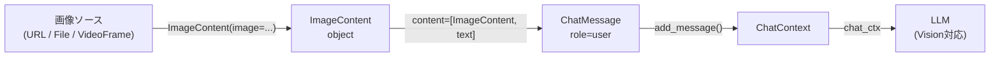

# Vision

参照元: [[SourceNotes/LiveKit_Agents_Documentation.md|LiveKit Agents Documentation]]
ロードマップ: [[StructureNotes/LiveKit_Agent_Framework_学習ロードマップ.md|学習ロードマップ]]
公式URL: https://docs.livekit.io/agents/multimodality/vision/

## What（何についてか）

LiveKit Agents に視覚（画像・動画）を持たせる方法。エージェントの ChatContext に `ImageContent` を追加することで LLM が画像を認識できるようになる。

## Why（なぜ必要か）

音声だけでは伝わらない情報（画面、資料、カメラ映像）をエージェントが理解できるようにするため。Vision 対応 LLM（GPT-4o、Gemini 等）の能力を活かす。

## How（どう動くか）



### 3つのユースケース

#### 1. 起動時に画像を渡す（Load into initial context）

```python
initial_ctx = ChatContext()
initial_ctx.add_message(
    role="user",
    content=[
        ImageContent(image="https://example.com/photo.jpg"),
        "What do you see?",
    ],
)
agent = Agent(instructions="...", chat_ctx=initial_ctx)
```

#### 2. フロントエンドからアップロード（Byte Stream）

```python
# エージェント側：トピック "images" にハンドラ登録
async def _image_received_handler(reader):
    image_bytes = await reader.read_all()
    data_url = f"data:image/jpeg;base64,{base64.b64encode(image_bytes).decode()}"
    session.chat_ctx.add_message(
        role="user",
        content=[ImageContent(image=data_url), "Analyze this."],
    )

ctx.room.register_byte_stream_handler("images", _image_received_handler)

# フロント側：LiveKit SDK で
# room.localParticipant.sendFile("images", file)
```

#### 3. 会話ごとにビデオフレームをサンプリング（STT-LLM-TTS Pipeline）

```python
class MyAgent(Agent):
    async def on_user_turn_completed(self, turn_ctx, new_message):
        # ユーザーが話し終えるたびに最新フレームを1枚追加
        for participant in self._session.room.remote_participants.values():
            for pub in participant.track_publications.values():
                if isinstance(pub.track, rtc.RemoteVideoTrack):
                    video_stream = rtc.VideoStream(pub.track)
                    async for event in video_stream:
                        turn_ctx.add_message(
                            role="user",
                            content=[ImageContent(
                                image=event.frame,
                                inference_width=1024,
                                inference_height=1024,
                            )],
                        )
                        break
                    await video_stream.aclose()
                    return
```

#### 4. ライブ動画入力（Python 限定）

```python
# RoomOptions(video_input=True) だけで自動的にフレームが入ってくる
await session.start(
    agent=Agent(instructions="..."),
    room=ctx.room,
    room_options=RoomOptions(video_input=True),
)

# フレームレート調整
session = AgentSession(
    ...,
    video_sampler=VideoSampler(fps_speaking=1, fps_idle=0.33),
)
```

## Key Concepts

| 用語 | 説明 |
|---|---|
| `ChatContext` | LLM に渡す会話履歴の箱。`ChatMessage` のリストを管理 |
| `ChatMessage` | role（system/user/assistant）と content（str/ImageContent/AudioContent の混在リスト） |
| `ImageContent` | 画像を表すオブジェクト。`image` に URL か `rtc.VideoFrame` を渡す |
| `inference_detail` | 画像のトークン使用量・品質を制御（auto/high/low）。OpenAI 等対応プロバイダのみ |
| Byte Stream | フロントからエージェントへのファイル転送の仕組み。トピック名（"images" 等）で区別 |
| `video_input=True` | Python 限定。RoomOptions に設定するだけでカメラ/画面共有を自動受信 |
| `VideoSampler` | ライブ動画のフレームレートをカスタマイズするクラス |

## ユースケース別まとめ

| ユースケース | 方法 | 備考 |
|---|---|---|
| 起動時に画像を渡す | `Agent(chat_ctx=...)` | URL or base64 |
| フロントからアップロード | `register_byte_stream_handler` | `sendFile` と対になる |
| 会話ごとにフレームを渡す | `on_user_turn_completed` でサンプリング | STT-LLM-TTS パイプライン |
| ライブ動画入力 | `RoomOptions(video_input=True)` | Python 限定、Realtime モデル推奨 |

## 一言まとめ

**`ImageContent` を `ChatContext` に積むだけ。ソースがURL・ファイル・VideoFrameどれでも同じ口で渡せる。ライブ動画だけ Python 限定。**
