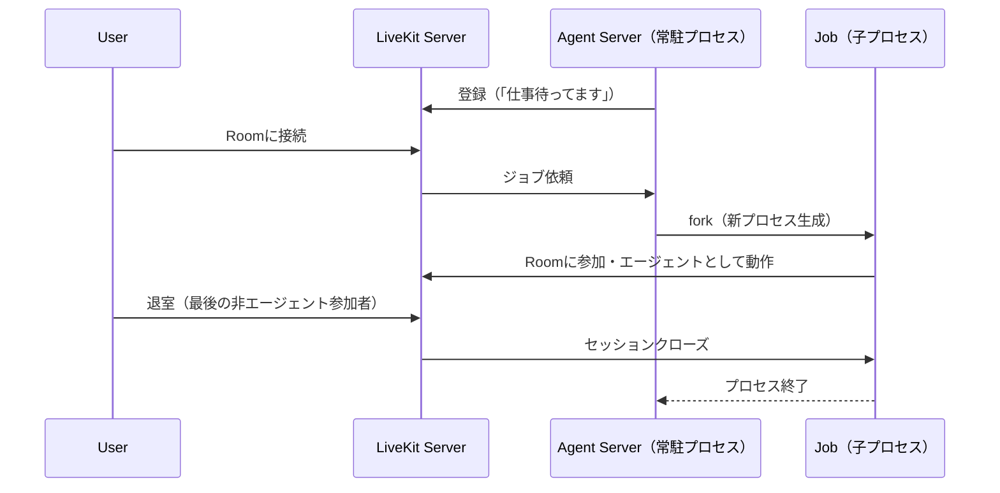

# Server Lifecycle

参照元: [[SourceNotes/LiveKit_Agents_Documentation.md|LiveKit Agents Documentation]]
ロードマップ: [[StructureNotes/LiveKit_Agent_Framework_学習ロードマップ.md|学習ロードマップ]]

## What（何についてか）

Agent ServerがLiveKit Serverに登録してから、ジョブを受け取り、セッションが終了するまでの一連のライフサイクル。

## Why（なぜ必要か）

エージェントをどう「待機・起動・終了」させるかを理解しないと、スケーリングやデプロイ時の挙動が読めない。インフラ層の基礎知識。

## How（どう動くか）

### 4ステップのライフサイクル

1. **Agent Server 登録** — 起動後、LiveKit Serverに「俺、仕事待ってます」と登録。ジョブが来るまでスタンバイ
2. **ジョブ依頼（Job Request）** — ユーザーがRoomに入ると、LiveKit ServerがAgent Serverにリクエストを送信。これをAgent Dispatchと呼ぶ
3. **ジョブ実行（Job）** — Agent Serverが子プロセスをforkし、Roomに参加してエージェントとして動作する。お前が書くコードの本体はここ
4. **セッション終了** — 最後の「非エージェント参加者」が退室したらRoomが自動クローズ。エージェントも切断される

## Key Concepts

| 用語 | 説明 |
|---|---|
| Agent Server | LiveKit Serverに登録してジョブを待ち受ける常駐プロセス。nginxみたいな存在 |
| Job | Agent Serverがforkした子プロセス。実際にRoomに参加してエージェントとして動く |
| Agent Dispatch | LiveKit ServerがAgent ServerにJobを割り当てる仕組み |
| Graceful Drain | デプロイ更新時、既存セッションが終わるまで待ってからシャットダウンする機能 |

### Server Features（地味にヤベー機能）

- **ロードバランシング自動化** — Agent Serverは常に空き状況をLiveKit Serverと交換。複数台デプロイで自動分散
- **プロセス分離** — Jobは独立プロセス。1つがクラッシュしても他のJobや親のAgent Serverは死なない
- **グレースフルドレイン** — デプロイ時に既存セッションを途中で切断しない

### なぜ「非エージェント参加者」が居なくなったらクローズ？

エージェントだけ残っても会話の目的（ユーザーとの対話）が消えている。プロセスを生かし続けることはリソースの無駄。**ユーザーがいなければエージェントの存在意義がない**という設計思想を仕組みに落とし込んでいる。

## 一言まとめ

Agent Serverは常駐してジョブを待ち受け、ユーザーがRoomに入るたびに子プロセス（Job）をforkしてエージェントを動かす。ユーザーが去ればJobも終わる——目的が消えたらリソースを解放するシンプルな設計。
