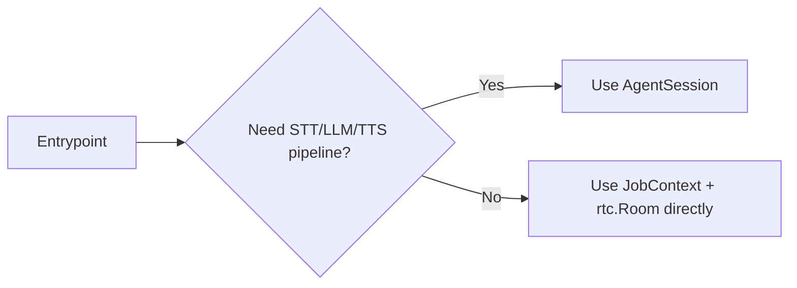
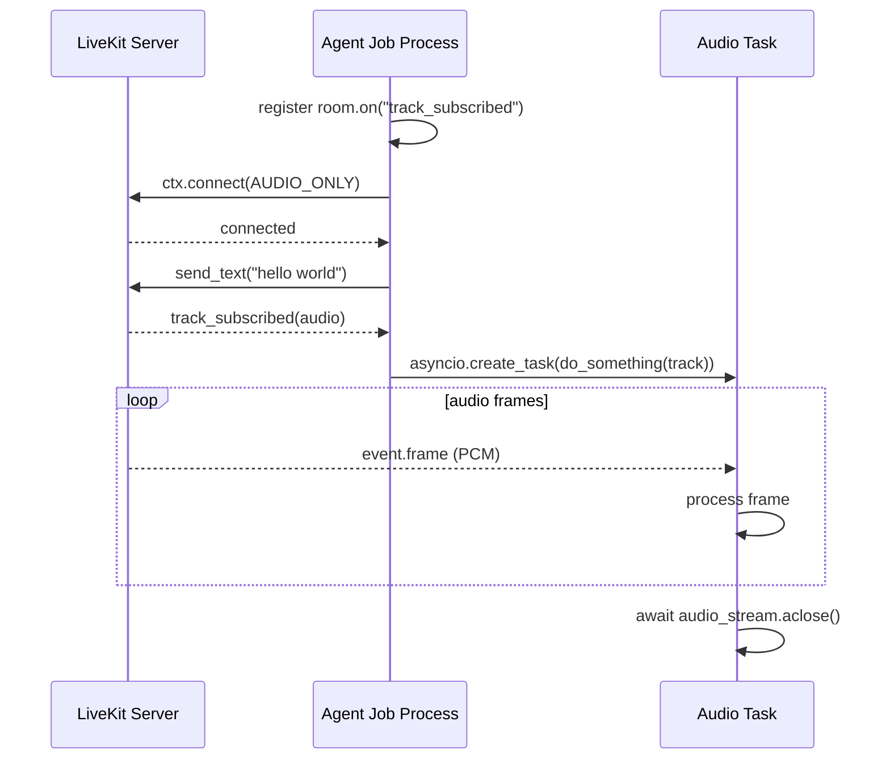

# Job Lifecycle

参照元: [[SourceNotes/LiveKit_Agents_Documentation.md|LiveKit Agents Documentation]]
ロードマップ: [[StructureNotes/LiveKit_Agent_Framework_学習ロードマップ.md|学習ロードマップ]]

## What（何についてか）

Job Lifecycle は、Agent Server がジョブを受け取ってから、entrypoint を実行し、Room に接続し、セッションを終了し、後処理を終えるまでの一連の流れを定義する。ここで重要なのは「ジョブがどこで始まり、どこで終わるか」をコードとして明確に扱う点で、単なる起動手順の説明ではない。

## Why（なぜ必要か）

LiveKit の運用では、起動よりも終了設計で品質差が出る。会話中の発話をどう切るか、後処理をどこまで同期でやるか、接続の主導権を AgentSession に預けるか手動で握るか、といった判断がそのまま UX と運用コストに跳ねるためだ。特に音声エージェントでは「急に切れないこと」と「不要なセッションを残さないこと」の両立が必須になる。

## How（どう動くか）

```mermaid
graph TD
    A[LiveKit Server dispatches job] --> B[Agent Server forks job process]
    B --> C[Entrypoint(JobContext) starts]
    C --> D{Use AgentSession?}
    D -->|Yes| E[AgentSession starts and connects]
    D -->|No| F[Manual ctx.connect()]
    E --> G[Run session logic]
    F --> G
    G --> H{End condition}
    H -->|all non-agent participants left| I[Session close]
    H -->|explicit shutdown/aclose| I
    I --> J[Shutdown hooks]
    J --> K[Process exits]
```

Agent Server と Job の関係は、常駐プロセスと実行プロセスの分離として理解すると整理しやすい。Agent Server は待受と配車を担当し、実際に Room に参加してロジックを動かすのは Job 側だ。この分離によって、ある Job が失敗しても他の Job と親プロセスへの影響を限定できる。

また、Room の自動終了条件が「最後の非エージェント参加者の退室」になっている理由は、対話の目的が消えたセッションを維持しないためだ。エージェントだけ残す運用は、価値のない接続を継続してコストを発生させる。つまりこの仕様は、対話モデルとリソース効率を同時に満たすための設計判断だ。

## AgentSession と JobContext 直操作の使い分け

通常の会話エージェントでは AgentSession を選ぶのが基本になる。STT/LLM/TTS パイプラインと接続管理を高レベル抽象に集約できるため、実装の主眼をアプリ固有ロジックに置けるからだ。一方で Echo bot や録音 bot のように AI 推論を要しない処理、あるいは E2E 暗号化などで接続タイミングを厳密制御したい処理では、JobContext と rtc.Room を直接扱う低レイヤー実装が有効になる。



## participant_entrypoint サンプルの要点

`participant_entrypoint.py` の本質は、接続前にイベント購読を登録し、接続後に流入するトラックを非同期処理へ受け渡す構造にある。`room.on("track_subscribed")` を先に仕込むのは、接続直後のイベント取りこぼしを避けるための定石だ。`ctx.connect(auto_subscribe=AutoSubscribe.AUDIO_ONLY)` は映像を除外して音声処理に集中する設定で、受け取った `RemoteAudioTrack` は `AudioStream` としてフレーム単位に処理できる。



## Job へデータを渡すときの考え方

データ注入は Job metadata、Room metadata、Participant attributes の3層で考えると混乱しない。固定ロジックを毎回 metadata に載せる必要はなく、セッション差分やユーザー差分だけを注入対象にすると責務が明確になる。たとえば tenant_id や user_id のような可変情報は metadata、言語ポリシーのようなセッション全体条件は Room metadata、権限やプランのような個別条件は Participant attributes が適切だ。

## 終了処理の設計

`shutdown(drain=True)` は会話体験を壊さない終了に向き、発話中断を避けたい音声 UX で有効だ。`aclose()` は完了まで待つ制御を保証しやすく、テストや厳密な終了判定に向いている。さらに shutdown hooks のタイムアウトは短いため、重い後処理はキューに退避してジョブ本体の終了を遅らせない設計が安全となる。

## Key Concepts

| 用語 | 説明 |
|---|---|
| Entrypoint | ジョブ起動時の入口関数（`@server.rtc_session`） |
| JobContext | Room接続・ログ文脈・participant処理などの基盤コンテキスト |
| AgentSession | 高レベル会話パイプライン抽象（通常はこちら） |
| Programmatic participant | AgentSessionなしでRTC低レイヤーを直接扱う参加者 |
| Shutdown hooks | 終了時の後処理フック |

## 一言まとめ

Job Lifecycle は「起動して動かす方法」よりも、「セッションを安全に閉じて、後処理まで破綻させない方法」を学ぶ章だ。通常は AgentSession で高速に作り、要件が明確なときだけ JobContext 直操作へ降りる、という運用判断が実装の軸になる。