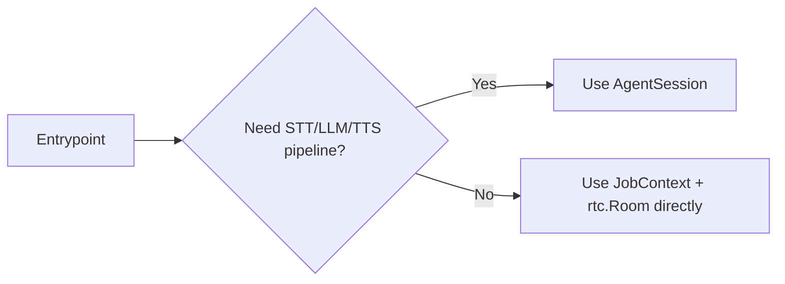
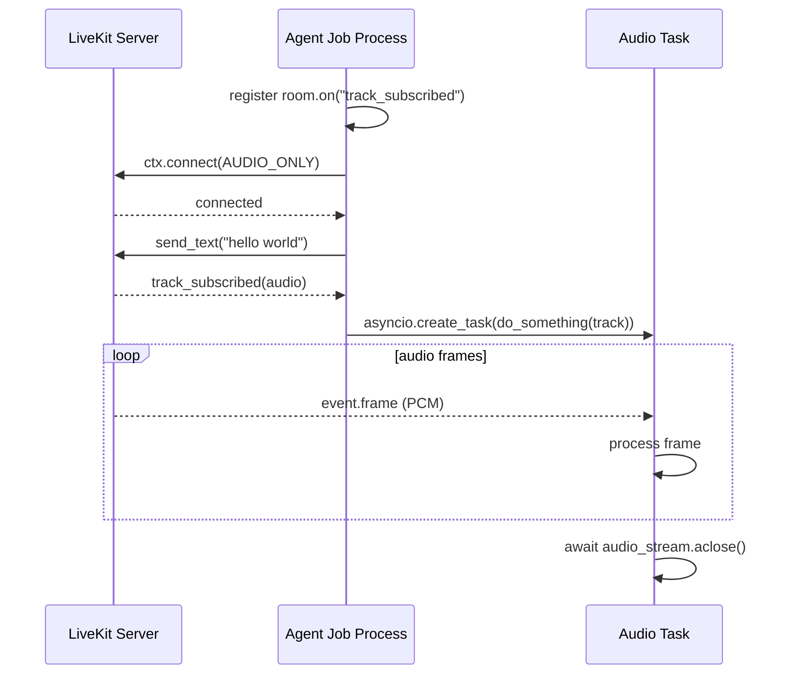

# Job Lifecycle

参照元: [[SourceNotes/LiveKit_Agents_Documentation.md|LiveKit Agents Documentation]]
ロードマップ: [[StructureNotes/LiveKit_Agent_Framework_学習ロードマップ.md|学習ロードマップ]]

## What（何についてか）

Job Lifecycle は、Agent Server がジョブを受け取ってから「entrypoint 実行 → Room接続 → セッション終了 → 後処理」までをどう扱うかの実行モデル。

Koeiの理解ベースで言うと、

- Agent Server = 常駐して仕事待ちする親プロセス
- Job = Roomに入って実際に処理する子プロセス

という分離構造の「子プロセス側のライフサイクル」を学ぶ章。

## Why（なぜ必要か）

実装で詰まりやすいのは起動時より終了時。特に以下は本番品質に直結する。

- いつRoom接続するか（AgentSession自動接続 / JobContext手動接続）
- どう終了するか（`shutdown(drain=True)` と `aclose()`）
- 後処理をどこまで同期でやるか（timeout制約）
- metadataでどの文脈をジョブへ渡すか

## How（どう動くか）

```mermaid
graph TD
    A[LiveKit Server dispatches job] --> B[Agent Server forks job process]
    B --> C[Entrypoint(JobContext) starts]
    C --> D{Use AgentSession?}
    D -->|Yes| E[AgentSession starts and connects]
    D -->|No| F[Manual ctx.connect()]
    E --> G[Run session logic]
    F --> G
    G --> H{End condition}
    H -->|all non-agent participants left| I[Session close]
    H -->|explicit shutdown/aclose| I
    I --> J[Shutdown hooks]
    J --> K[Process exits]
```

## Koeiとの対話で固まった理解

### 1) Agent Server と Job の違い

Koeiの言語化：

> Agent Server はサーバー上の常駐プロセスで、JobはRoomに実際に参加する子プロセス。

この理解で正しい。重要ポイントは「障害分離」。

- Jobがクラッシュしても親のAgent Serverは生きる
- 他のJobへの影響を最小化できる
- 高並行時のスケールと安定性に効く

### 2) 「最後の非エージェント参加者が抜けたら閉じる」理由

Koeiの問い：

> Agent は対人設計されてるから？

答えはそれに加えて「コスト最適化」。

- ユーザーがいないRoomを維持しても価値がない
- エージェントだけ残ると無駄なプロセス/接続コストが続く
- 対話セッション単位の設計思想に合致する

### 3) AgentSessionを使わないケース

基本は AgentSession を使う理解でOK。ただし例外はある。

- Echo bot / 録音bot / 中継botのようなプログラム参加者
- 接続タイミングを厳密制御したいケース（E2E暗号化など）



## Participant entrypoint / 低レイヤー実装の読み解き

Koeiが深掘りしたサンプル（`participant_entrypoint.py`）の要点。

### 流れ

1. `room.on("track_subscribed")` を **connect前** に登録
2. `await ctx.connect(auto_subscribe=AutoSubscribe.AUDIO_ONLY)`
3. 音声トラック購読時に `do_something(track)` を非同期起動
4. `AudioStream(track)` でPCMフレームを逐次処理

### なぜ connect 前に listener を張るのか

- connect後すぐ流れてくるイベントを取りこぼさないため
- 実運用でのレースコンディション回避パターン

### 全体シーケンス（syntax修正版）



## データ注入（Jobに文脈を渡す）

| レイヤー | 何に使うか | 例 |
|---|---|---|
| Job metadata | dispatch時の初期条件 | user_id, tenant_id, mode |
| Room metadata | セッション全体の条件 | language, policy |
| Participant attributes | 参加者ごとの条件 | role, plan |

指針：

- 不変条件はコード固定
- セッション/ユーザー差分はmetadataで注入

## セッション終了戦略（重要）

| メソッド | 性質 | 使いどころ |
|---|---|---|
| `shutdown(drain=True)` | グレースフル寄り（発話を流し切る） | 音声UX重視 |
| `aclose()` | 完了まで待つ明示終了 | 制御厳密・テスト容易 |

## 後処理（Shutdown hooks）

- セッション終了後にDB保存・イベント送信などを実行
- タイムアウトは短い（既定で約10秒）
- 重い処理はキューへオフロードする設計が安全

## Key Concepts

| 用語 | 説明 |
|---|---|
| Entrypoint | ジョブ起動時の入口関数（`@server.rtc_session`） |
| JobContext | Room接続・ログ文脈・participant処理などの基盤コンテキスト |
| AgentSession | 高レベル会話パイプライン抽象（通常はこちら） |
| Programmatic participant | AgentSessionなしでRTC低レイヤーを直接扱う参加者 |
| Shutdown hooks | 終了時の後処理フック |

## 一言まとめ

Job Lifecycleは「Agentを動かす章」じゃなく「**安全に回して安全に終わらせる章**」。
Koeiの文脈では、通常は AgentSession を使い、例外時だけ JobContext 直操作に降りる——この判断軸を持てば実装がブレない。
