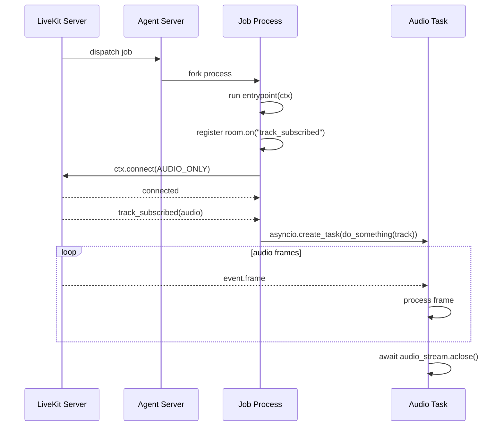

# Job Lifecycle

参照元: [[SourceNotes/LiveKit_Agents_Documentation.md|LiveKit Agents Documentation]]
ロードマップ: [[StructureNotes/LiveKit_Agent_Framework_学習ロードマップ.md|学習ロードマップ]]

## What（何についてか）

Job Lifecycle は、Agent Server が dispatch を受けた後に fork した Job プロセスが、
entrypoint 実行から Room 接続、セッション終了、後処理までを完了する実行ライフサイクルである。

本ノートは概念説明よりも、実際に書くコードと実行時挙動の対応を重視して整理する。

## Job の入口: Entrypoint

まず起点になるのは `@server.rtc_session()` で宣言した entrypoint 関数である。

```python
@server.rtc_session()
async def entrypoint(ctx: JobContext):
    # ここからジョブの処理が始まる
    ...
```

この関数は Job ごとに実行される。
つまり、同時に複数 Room が動けば entrypoint も Job 単位で独立して並行実行される。

## AgentSession を使わない低レイヤー実装（公式サンプル）

学習時に確認した `participant_entrypoint.py` は、AgentSession を使わず
`JobContext` と `rtc.Room` を直接扱う構成になっている。

```python
async def do_something(track: rtc.RemoteAudioTrack):
    audio_stream = rtc.AudioStream(track)
    async for event in audio_stream:
        # event.frame を処理
        pass
    await audio_stream.aclose()

@server.rtc_session(agent_name="my-agent")
async def my_agent(ctx: JobContext):
    room = ctx.room

    @room.on("track_subscribed")
    def on_track_subscribed(track: rtc.Track, *_):
        if track.kind == rtc.TrackKind.KIND_AUDIO:
            asyncio.create_task(do_something(track))

    await ctx.connect(auto_subscribe=AutoSubscribe.AUDIO_ONLY)

    await room.local_participant.send_text('hello world', topic='hello-world')

    for rp in room.remote_participants.values():
        print(rp.identity)
```

このサンプルで重要なのは次の3点である。

1) `room.on("track_subscribed")` を connect 前に登録している。
接続直後に到着するイベントの取りこぼしを防ぐためである。

2) `ctx.connect(auto_subscribe=AutoSubscribe.AUDIO_ONLY)` により、
音声トラックだけを自動購読して処理対象を限定している。

3) `rtc.AudioStream(track)` を使うことで、
`event.frame`（PCMフレーム）を逐次非同期処理できる。

## 実行シーケンス（コード対応）



## AgentSession あり/なしの判断基準

会話エージェント開発では AgentSession の採用が基本となる。

```python
# 典型: AgentSession を使う構成（概念）
session = AgentSession(...)
await session.start(agent=agent, room=ctx.room)
```

AgentSession なしの構成は、次のように目的が明確な場合に限定するのが妥当である。

- Echo bot / 録音 bot / 中継 bot のように STT/LLM/TTS を要しない
- E2E 暗号化等で接続タイミングを厳密制御したい

要するに「会話パイプラインが必要なら AgentSession、不要なら JobContext 直操作」という整理で設計判断が安定する。

## Job へデータを渡す設計

dispatch と実行時文脈の受け渡しは、以下の3層で考えると実装しやすい。

- Job metadata: dispatch 時に投入する可変条件（例: `user_id`, `tenant_id`）
- Room metadata: セッション共通条件（例: 言語方針）
- Participant attributes: 参加者単位条件（例: ロール、プラン）

固定ロジックはコードに残し、可変条件だけを metadata 側に寄せると責務分離が明確になる。

## セッション終了: shutdown と aclose

終了戦略は音声 UX と制御性のトレードオフで選ぶ。

```python
# 発話を流し切る終了
await session.shutdown(drain=True)

# 完了まで待つ終了
await session.aclose()
```

`shutdown(drain=True)` は対話体験の連続性を保ちやすい。
`aclose()` は終了同期を取りやすく、テストや厳密な制御に適する。

## 後処理（Shutdown Hooks）

セッション終了後の DB 書き込みやイベント送信は hook 側で実行できる。
ただしタイムアウト制約が短いため、重い処理はキューへ委譲する設計が望ましい。

## Key Concepts

| 用語 | 説明 |
|---|---|
| Entrypoint | `@server.rtc_session` で定義するジョブ入口関数 |
| JobContext | Room接続・参加者処理・ログ文脈を扱う基盤コンテキスト |
| AgentSession | STT/LLM/TTS を含む高レベル会話実行抽象 |
| Programmatic participant | AgentSessionなしで RTC を直接扱う参加者実装 |
| Shutdown hooks | セッション終了後に実行する後処理フック |

## 一言まとめ

Job Lifecycle の本質は、Job を「開始できること」ではなく、
接続・処理・終了・後処理までをコードとして一貫制御できることにある。

会話エージェント開発では AgentSession を標準手段とし、
低レイヤー実装は要件が明確な場面で選択するのが合理的である。
