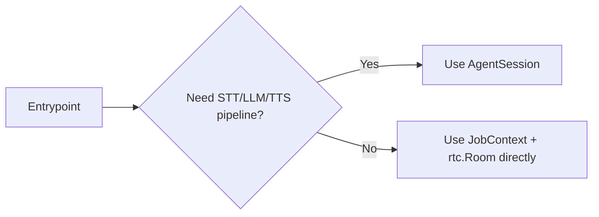
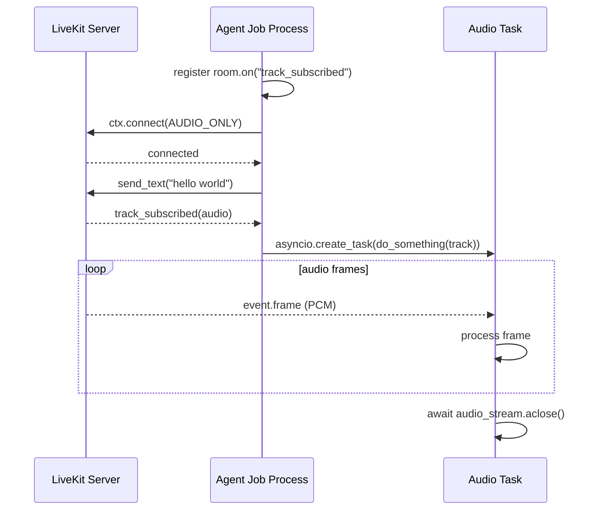

# Job Lifecycle

参照元: [[SourceNotes/LiveKit_Agents_Documentation.md|LiveKit Agents Documentation]]
ロードマップ: [[StructureNotes/LiveKit_Agent_Framework_学習ロードマップ.md|学習ロードマップ]]

## What（何についてか）

Job Lifecycle は、Agent Server がジョブを受け取ってから、entrypoint の実行、Room 接続、セッション終了、後処理完了までを定義する実行モデルである。

本章の対象は起動手順の列挙ではなく、ジョブ単位での責務境界と終了条件の設計である。

## Why（なぜ必要か）

LiveKit 運用における品質差は、起動よりも終了設計で顕在化しやすい。

具体的には、接続主導権（AgentSession 自動接続か手動接続か）、終了戦略（`shutdown(drain=True)` と `aclose()` の選択）、および後処理の同期範囲が、UX と運用コストに直接影響する。

特に音声エージェントでは、発話中断を避ける設計と、不要セッションを速やかに解放する設計の両立が必要となる。

## How（どう動くか）

```mermaid
graph TD
    A[LiveKit Server dispatches job] --> B[Agent Server forks job process]
    B --> C[Entrypoint(JobContext) starts]
    C --> D{Use AgentSession?}
    D -->|Yes| E[AgentSession starts and connects]
    D -->|No| F[Manual ctx.connect()]
    E --> G[Run session logic]
    F --> G
    G --> H{End condition}
    H -->|all non-agent participants left| I[Session close]
    H -->|explicit shutdown/aclose| I
    I --> J[Shutdown hooks]
    J --> K[Process exits]
```

Agent Server と Job は、待受プロセスと実行プロセスとして分離される。

この分離により、単一ジョブ障害の影響範囲を局所化し、他ジョブおよび親プロセスの継続性を確保できる。

また、Room の自動終了条件が「最後の非エージェント参加者の退室」となるのは、対話目的が消失したセッションの継続を防ぐためである。

これはコスト効率とセッション意味論を同時に満たす設計である。

## AgentSession と JobContext 直操作の使い分け

通常の会話エージェントでは AgentSession の利用が基本となる。

理由は、STT/LLM/TTS パイプラインと接続管理を高レベル抽象へ集約でき、アプリケーション固有ロジックへ実装資源を集中できるためである。

一方、Echo bot・録音 bot・中継 bot のように AI 推論を前提としない処理、または E2E 暗号化等で接続タイミングを厳密制御する処理では、JobContext と rtc.Room の直接操作が有効である。



## participant_entrypoint サンプルの解釈

`participant_entrypoint.py` の要点は、接続前にイベント購読を登録し、接続後のトラックイベントを非同期処理へ受け渡す構造にある。

`room.on("track_subscribed")` を connect 前に設定するのは、接続直後のイベント取りこぼしを回避するためである。

`ctx.connect(auto_subscribe=AutoSubscribe.AUDIO_ONLY)` は映像購読を抑制し、音声処理へ計算資源を集中させる設定である。



## Job へのデータ注入

データ注入は Job metadata、Room metadata、Participant attributes の三層で整理すると設計が安定する。

固定ロジックはコードへ保持し、可変条件のみを metadata として注入する方針が望ましい。

例えば、tenant_id や user_id は Job metadata、セッション共通方針は Room metadata、個別権限やプラン情報は Participant attributes が適切である。

## 終了処理の設計

`shutdown(drain=True)` は発話完了を優先するグレースフル終了に適し、音声 UX を維持しやすい。

`aclose()` は完了同期を明示しやすく、厳密な終了判定やテストで扱いやすい。

なお、shutdown hooks の許容時間は短いため、重い後処理はキューへ退避し、ジョブ終了を阻害しない設計が推奨される。

## Key Concepts

| 用語 | 説明 |
|---|---|
| Entrypoint | ジョブ起動時の入口関数（`@server.rtc_session`） |
| JobContext | Room接続・ログ文脈・participant処理の基盤コンテキスト |
| AgentSession | 高レベル会話パイプライン抽象 |
| Programmatic participant | AgentSessionなしでRTC低レイヤーを直接扱う参加者 |
| Shutdown hooks | 終了時の後処理フック |

## 一言まとめ

Job Lifecycle は、ジョブを開始する方法よりも、セッションを安全に終了し、後処理まで破綻なく完了させるための設計原則を扱う章である。

通常は AgentSession を基本選択とし、要件が明確な場合に限って JobContext 直操作へ移行する運用判断が有効である。
