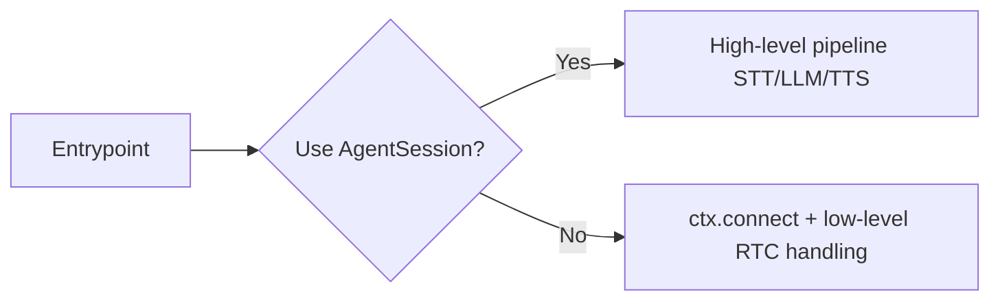

# Job Lifecycle

参照元: [[SourceNotes/LiveKit_Agents_Documentation.md|LiveKit Agents Documentation]]
ロードマップ: [[StructureNotes/LiveKit_Agent_Framework_学習ロードマップ.md|学習ロードマップ]]

## What（何についてか）

Agent Server がジョブを受け取ってから、entrypoint 実行・Room接続・終了処理・後処理までをどう扱うか。

## Why（なぜ必要か）

インフラ実装では「どう起動するか」だけでなく「どう安全に終わるか」が同じくらい重要。終了設計（shutdown/aclose, hook, timeout）を理解しないと運用で詰む。

## How（どう動くか）

```mermaid
graph TD
    A[Agent Server accepts job] --> B[New process starts]
    B --> C[Entrypoint(JobContext) runs]
    C --> D[Connect to room]
    D --> E[Run agent logic]
    E --> F{End condition}
    F -->|all non-agent participants leave| G[Session closes]
    F -->|explicit shutdown/aclose| G
    G --> H[Shutdown hooks]
    H --> I[Process exits]
```

## Key Concepts

| 用語 | 説明 |
|---|---|
| Entrypoint | ジョブごとに実行されるメイン関数。ここから制御を握る |
| JobContext | Room接続やログ文脈、participant entrypointなどを扱うコンテキスト |
| AgentSession | 高レベル抽象（通常の会話AIは基本これを使う） |
| Programmatic participant | AgentSessionなしで低レイヤー制御する参加者（Echo bot等） |

## AgentSession を使わないケース

ドキュメント上は AgentSession なしでも実装可能。

- **通常ケース:** AgentSession を使う（Koeiの想定ユースケースはこちら）
- **例外ケース:** Echo bot、単純中継、特殊接続制御（E2E暗号化タイミング制御など）



## Participant entrypoint function

`ctx.add_participant_entrypoint()` で「参加者ごと」に走る処理を登録できる。

- connect前に登録する
- 既存参加者 + 新規参加者の両方に適用
- 複数登録可能（参加者ごとに並列実行）

## Adding custom fields to agent logs

`JobContext.log_context_fields` でログに独自フィールドを追加する。

実務では以下を推奨：
- JSONに安全に落ちる値（str/int/bool/短いdict）
- PIIや巨大データは避ける
- 分析したい軸（tenant_id, room_name, worker_id）を設計段階で決める

## Passing data to a job

データ注入には3レイヤーある：

| レイヤー | 役割 | 例 |
|---|---|---|
| Job metadata | ジョブ初期条件（dispatch時） | mode, tenant_id |
| Room metadata | セッション環境条件 | language, policy |
| Participant attributes | ユーザー個別条件 | role, plan |

### Koeiの理解ポイント

「初期条件ならコード固定で良いのでは？」は正しい視点。実務では以下で使い分ける：

- 不変ロジック → コード固定
- テナント/ユーザー/セッション差分 → metadata注入

## Ending the session

`shutdown()` と `aclose()` の違いが重要。

- `shutdown(drain=True)`：発話を流し切る等のグレースフル終了（UX重視）
- `aclose()`：完了までawaitする即時性の高い終了（制御重視）

## Post-processing and cleanup

shutdown hooksで後処理を実行（DB保存、イベント送信など）。

- デフォルトは短いタイムアウト（約10秒）
- 重い処理はキューへオフロード（イベント駆動が相性良い）

## 一言まとめ

Job Lifecycleは「起動」より「終了と後処理」が本番品質を決める。AgentSessionを基本にしつつ、metadata注入・終了戦略・非同期後処理で運用耐性を作る。
