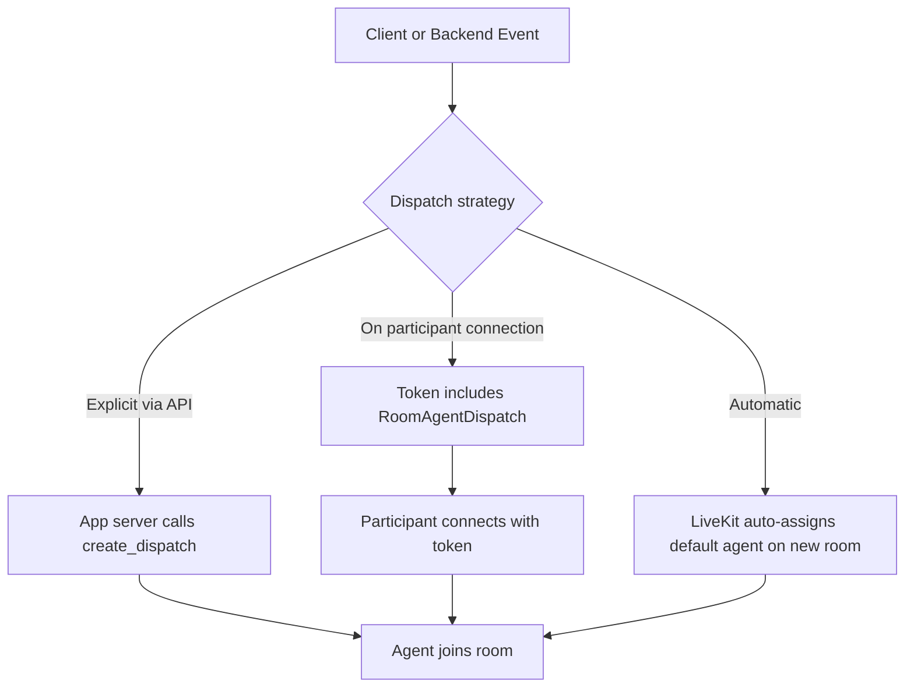
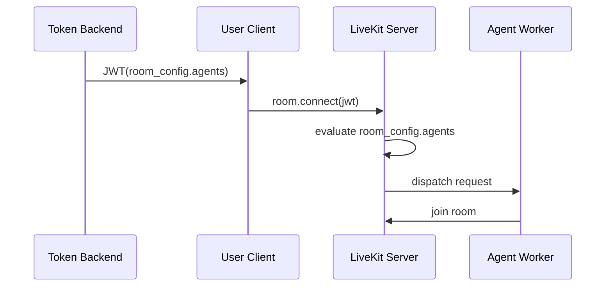

# Agent Dispatch

参照元: [[SourceNotes/LiveKit_Agents_Documentation.md|LiveKit Agents Documentation]]
ロードマップ: [[StructureNotes/LiveKit_Agent_Framework_学習ロードマップ.md|学習ロードマップ]]

## What（何についてか）

Agent Dispatch は、どの Agent を、どの Room に、どの時点で参加させるかを決定する制御機構である。

本機構は Agent 実装そのものではなく、参加判断と割り当てを担う制御プレーンに位置づけられる。

## Why（なぜ必要か）

自動 dispatch は単純運用に適する一方、全 Room 一律挙動になりやすい。

実サービスでは、ユーザー属性、テナント条件、通話種別、操作トリガーに応じて参加 Agent や参加時点を変える必要がある。

明示的 dispatch はこの要求に対応し、metadata によりジョブ開始時コンテキストを注入できるため、運用柔軟性が高い。

## How（どう動くか）



方式選択の基準は「参加時点」である。

入室と同時に参加させる場合は token dispatch、任意タイミングで参加させる場合は API dispatch が適合する。

## Dispatch via API の責務

`create_dispatch` は、一般に Agent Worker 側ではなくアプリケーションバックエンド側へ配置する。

理由は、ここが「参加可否を判断する層」であり、権限確認や業務イベント判定と同一責務線上にあるためである。

```python
import asyncio
from livekit import api

room_name = "my-room"
agent_name = "test-agent"

async def create_explicit_dispatch():
    lkapi = api.LiveKitAPI()
    dispatch = await lkapi.agent_dispatch.create_dispatch(
        api.CreateAgentDispatchRequest(
            agent_name=agent_name,
            room=room_name,
            metadata='{"user_id": "12345"}'
        )
    )
    print("created dispatch", dispatch)

    dispatches = await lkapi.agent_dispatch.list_dispatch(room_name=room_name)
    print(f"there are {len(dispatches)} dispatches in {room_name}")

    await lkapi.aclose()

asyncio.run(create_explicit_dispatch())
```

## Dispatch on participant connection の実行タイミング

`create_token_with_agent_dispatch()` が行う処理は JWT 発行までであり、その時点では Room 参加は発生しない。

実際の dispatch は、クライアントが当該トークンで `room.connect()` を実行した時点で LiveKit 側により評価・実行される。

```python
from livekit.api import (
    AccessToken,
    RoomAgentDispatch,
    RoomConfiguration,
    VideoGrants,
)

room_name = "my-room"
agent_name = "test-agent"

def create_token_with_agent_dispatch() -> str:
    token = (
        AccessToken()
        .with_identity("my_participant")
        .with_grants(VideoGrants(room_join=True, room=room_name))
        .with_room_config(
            RoomConfiguration(
                agents=[
                    RoomAgentDispatch(agent_name="test-agent", metadata='{"user_id": "12345"}')
                ],
            ),
        )
        .to_jwt()
    )
    return token
```



## 具体ユースケース

会議 Room に参加済みユーザーが「AI呼び出し」操作を実行した時点で、アプリサーバーが `create_dispatch` を発行する設計は典型的な明示的 dispatch である。

この場合、権限確認後に `purpose=minutes` や `requested_by` を metadata として渡すことで、同一 Agent でも開始コンテキストを切り替えられる。

結果として、必要時のみ参加させる運用を実現できる。

## Key Concepts

| 用語 | 説明 |
|---|---|
| Automatic dispatch | 新規 Room ごとにデフォルト Agent を自動割当 |
| Explicit dispatch | `agent_name` 指定で自動割当を停止し、明示制御する方式 |
| AgentDispatchService | API経由で dispatch を作成・管理するサービス |
| Job metadata | dispatch時に渡す文字列データ（JSON推奨） |
| RoomAgentDispatch | トークン内 room_config で participant 接続時 dispatch を指示 |

## 一言まとめ

Agent Dispatch は Agent 実装技術ではなく、参加時点と参加対象を制御する運用技術である。

入室同時参加は token dispatch、任意時点参加は API dispatch と整理すると、実装責務と運用設計を一貫して扱える。
