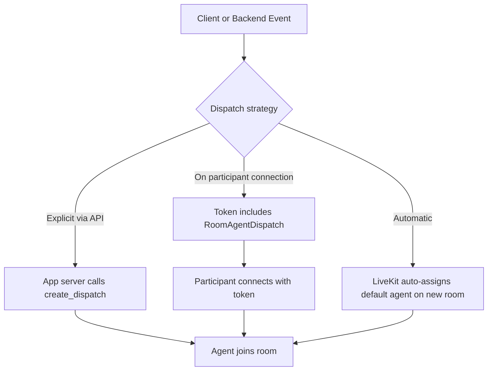
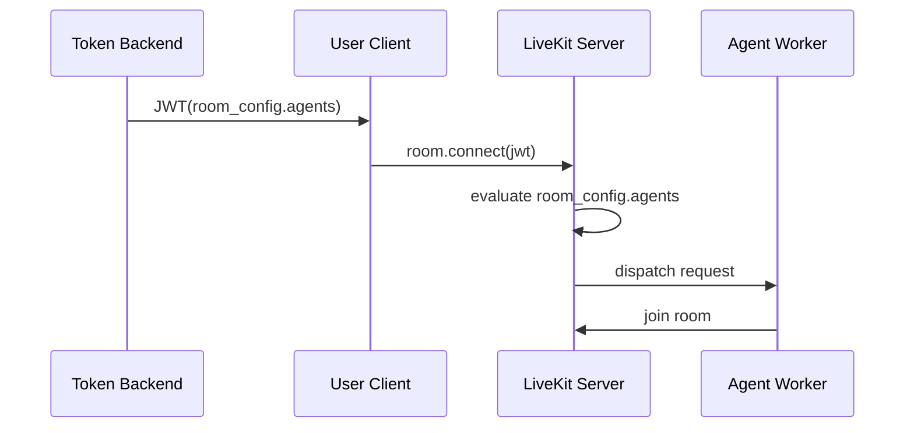

# Agent Dispatch

参照元: [[SourceNotes/LiveKit_Agents_Documentation.md|LiveKit Agents Documentation]]
ロードマップ: [[StructureNotes/LiveKit_Agent_Framework_学習ロードマップ.md|学習ロードマップ]]

## What（何についてか）

Agent Dispatch は「どの Agent を、どの Room に、どのタイミングで参加させるか」を決める制御プレーンである。ここで扱うのは Agent の実装そのものではなく、参加の決定と割り当ての仕組みだ。自動 dispatch は一律運用、明示的 dispatch は条件付き運用を担う。

## Why（なぜ必要か）

自動 dispatch は単純で強いが、全 Room 一律の挙動になりやすい。実サービスでは、ユーザー属性・テナント・通話種別・トリガー操作に応じて参加可否や参加 Agent を変えたくなる。そのときに必要なのが明示的 dispatch で、metadata を使ってジョブ開始時点の文脈まで渡せる点が運用上の決定的な差になる。

## How（どう動くか）



運用では「いつ参加させたいか」で方式を選ぶ。入室イベントと同時に参加させたいならトークンに `RoomAgentDispatch` を埋め込む方式が素直で、任意タイミングで後から参加させたいなら `create_dispatch` API を叩く方式が適合する。

## Dispatch via API の位置づけ

`create_dispatch` を呼ぶコードは Agent Worker 側ではなく、通常はアプリケーションバックエンド側に置く。ここは「参加を判断する層」だからだ。たとえば管理画面操作、Webhook、業務イベント、SIP着信などをトリガーに dispatch を発行し、必要な文脈を metadata として渡す。

```python
import asyncio
from livekit import api

room_name = "my-room"
agent_name = "test-agent"

async def create_explicit_dispatch():
    lkapi = api.LiveKitAPI()
    dispatch = await lkapi.agent_dispatch.create_dispatch(
        api.CreateAgentDispatchRequest(
            agent_name=agent_name,
            room=room_name,
            metadata='{"user_id": "12345"}'
        )
    )
    print("created dispatch", dispatch)

    dispatches = await lkapi.agent_dispatch.list_dispatch(room_name=room_name)
    print(f"there are {len(dispatches)} dispatches in {room_name}")

    await lkapi.aclose()

asyncio.run(create_explicit_dispatch())
```

## Dispatch on participant connection の誤解しやすい点

`create_token_with_agent_dispatch()` が行うのは、dispatch設定を含む JWT の発行までである。ここではまだ Room 参加は発生しない。実際の dispatch は、クライアントがそのトークンで `room.connect()` を実行した瞬間に LiveKit 側で評価され、Agent の参加が走る。

```python
from livekit.api import (
    AccessToken,
    RoomAgentDispatch,
    RoomConfiguration,
    VideoGrants,
)

room_name = "my-room"
agent_name = "test-agent"

def create_token_with_agent_dispatch() -> str:
    token = (
        AccessToken()
        .with_identity("my_participant")
        .with_grants(VideoGrants(room_join=True, room=room_name))
        .with_room_config(
            RoomConfiguration(
                agents=[
                    RoomAgentDispatch(agent_name="test-agent", metadata='{"user_id": "12345"}')
                ],
            ),
        )
        .to_jwt()
    )
    return token
```



## 具体ユースケース（議事録ボット）

会議 Room に A/B が参加し、B が「AI呼び出し」ボタンを押した時点でアプリサーバーが `create_dispatch` を発行する設計は、明示的 dispatch の典型例になる。権限確認を通した上で `purpose=minutes` や `requested_by=B` を metadata に渡せば、同じ Agent でも開始時コンテキストを変えられる。これにより「必要な時だけ参加させる」運用を自然に実現できる。

## Key Concepts

| 用語 | 説明 |
|---|---|
| Automatic dispatch | 新規 Room ごとにデフォルト Agent を自動割当 |
| Explicit dispatch | `agent_name` 指定で自動を切り、明示制御する方式 |
| AgentDispatchService | API経由で dispatch を作成/管理するサービス |
| Job metadata | dispatch時に渡す文字列データ（JSON推奨） |
| RoomAgentDispatch | トークン内 room_config で participant 接続時 dispatch を指示 |

## 一言まとめ

Agent Dispatch は「Agentを作る技術」ではなく「Agentをいつ参加させるかを決める技術」だ。入室同時参加なら token dispatch、任意タイミング参加なら API dispatch、という軸で分けると設計が崩れない。