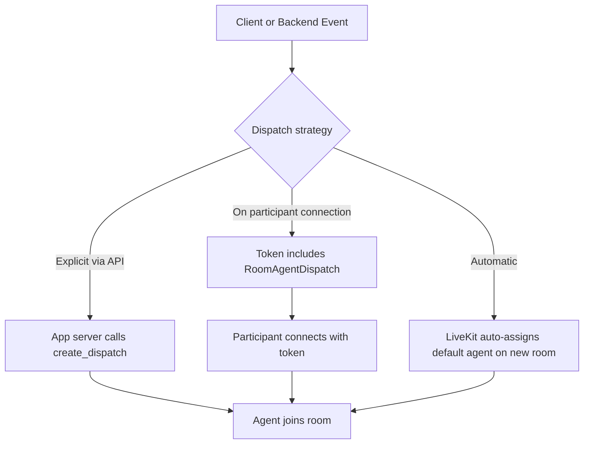
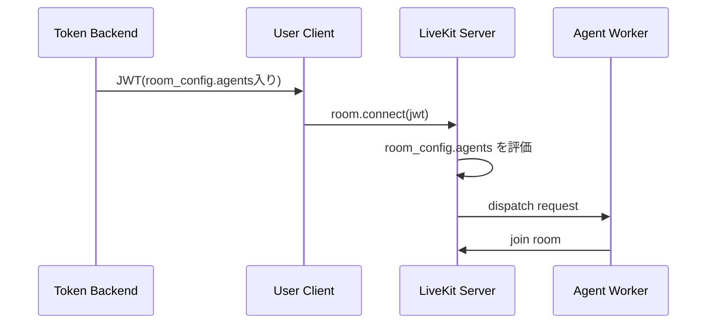

# Agent Dispatch

参照元: [[SourceNotes/LiveKit_Agents_Documentation.md|LiveKit Agents Documentation]]
ロードマップ: [[StructureNotes/LiveKit_Agent_Framework_学習ロードマップ.md|学習ロードマップ]]

## What（何についてか）

Agent dispatch は「どの Agent を、いつ、どの Room に参加させるか」を決める仕組み。
LiveKit では以下の2パターンで運用する。

- 自動 dispatch: 新規 Room に自動で Agent を割り当てる
- 明示的 dispatch: API またはトークン設定で、条件付きで Agent を割り当てる

## Why（なぜ必要か）

単一用途のデモなら自動 dispatch で十分だが、本番運用では次が必要になる。

- ユーザー/テナントごとに Agent を切り替える
- 任意タイミング（ボタン押下など）で Agent を呼び出す
- ジョブに文脈（metadata）を渡して挙動を変える
- 複数 Agent を同居させる

つまり、**「全 Room 一律」ではなく「状況に応じた参加制御」**のために明示的 dispatch が必要。

## How（どう動くか）



## Dispatch via API と Token dispatch の違い

| 方式 | どこに書くか | いつ発火するか | 向いている用途 |
|---|---|---|---|
| Dispatch via API (`create_dispatch`) | アプリサーバー/管理バックエンド | 任意タイミング（イベント駆動） | 「今このRoomにこのAgentを参加」 |
| Dispatch on participant connection (`RoomAgentDispatch`) | トークン発行バックエンド | participant の `room.connect()` 成功時 | 入室と同時にAgent参加 |

## コード解説（Koeiの疑問ベース）

### 1) Dispatch via API

```python
import asyncio
from livekit import api

room_name = "my-room"
agent_name = "test-agent"

async def create_explicit_dispatch():
    lkapi = api.LiveKitAPI()
    dispatch = await lkapi.agent_dispatch.create_dispatch(
        api.CreateAgentDispatchRequest(
            agent_name=agent_name,
            room=room_name,
            metadata='{"user_id": "12345"}'
        )
    )
    print("created dispatch", dispatch)

    dispatches = await lkapi.agent_dispatch.list_dispatch(room_name=room_name)
    print(f"there are {len(dispatches)} dispatches in {room_name}")

    await lkapi.aclose()

asyncio.run(create_explicit_dispatch())
```

- これは **Agent 本体を定義するコードではない**。
- これは **Agent参加を指示する管理コード**（運用ロジック側）。
- 書く場所は Agent Worker とは別のことが多い（例: FastAPI バックエンド）。
- `metadata` で `user_id`, `call_id`, `tenant_id` などを JobContext に渡せる。

### 2) Dispatch on participant connection

```python
from livekit.api import (
    AccessToken,
    RoomAgentDispatch,
    RoomConfiguration,
    VideoGrants,
)

room_name = "my-room"
agent_name = "test-agent"

def create_token_with_agent_dispatch() -> str:
    token = (
        AccessToken()
        .with_identity("my_participant")
        .with_grants(VideoGrants(room_join=True, room=room_name))
        .with_room_config(
            RoomConfiguration(
                agents=[
                    RoomAgentDispatch(agent_name="test-agent", metadata='{"user_id": "12345"}')
                ],
            ),
        )
        .to_jwt()
    )
    return token
```

- この関数がしているのは **JWT発行のみ**。
- この時点ではまだ Room に誰も参加していない。
- 実際に Agent が入るのは、**このトークンで participant が `room.connect()` したとき**。



## Koeiの理解ログ（対話で固まった点）

- 「Agentを定義するサーバー」と「Dispatchを判断するサーバー」は分離できるし、実運用では分離が自然。
- 「入室と同時参加」は token dispatch で実現でき、別途API呼び出し不要。
- 「入室後にBさんがボタンでAI招待」は API dispatch が適切。

具体例（議事録ボット）:
1. A/B が Room 参加
2. B が「AI呼び出し」ボタン押下
3. アプリサーバーが権限確認
4. `create_dispatch(room, agent_name, metadata)` 実行
5. Agent が Room に参加して議事録開始

## 実務での使い分け

- **デモ/単機能:** 自動 dispatch
- **本番/多要件:** 明示的 dispatch（API + metadata）
- **入室即同伴:** token dispatch
- **任意タイミング招待:** create_dispatch API

## Key Concepts

| 用語 | 説明 |
|---|---|
| Automatic dispatch | 新規 Room ごとにデフォルト Agent を自動割当 |
| Explicit dispatch | `agent_name` 指定で自動を切り、明示制御する方式 |
| AgentDispatchService | API経由で dispatch を作成/管理するサービス |
| Job metadata | dispatch時に渡す文字列データ（JSON推奨） |
| RoomAgentDispatch | トークン内 room_config で participant 接続時 dispatch を指示 |

## 一言まとめ

Agent Dispatch は「Agentを作る仕組み」ではなく「Agent参加の制御プレーン」。
**入室同時なら token dispatch、後から呼ぶなら API dispatch**。この使い分けが実装の要だ。
