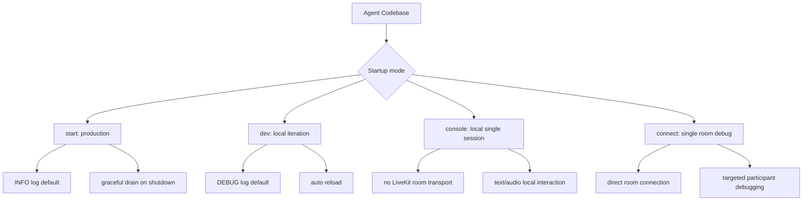
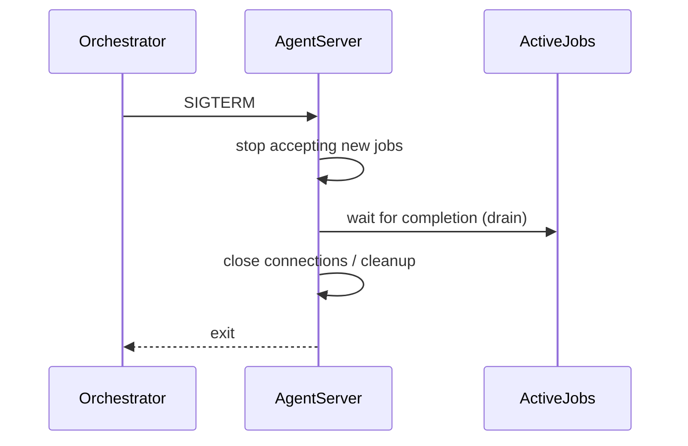

# Server Startup Modes

参照元: [[SourceNotes/LiveKit_Agents_Documentation.md|LiveKit Agents Documentation]]
ロードマップ: [[StructureNotes/LiveKit_Agent_Framework_学習ロードマップ.md|学習ロードマップ]]

## What（何についてか）

Server Startup Modes は、同一の Agent 実装を運用目的に応じた実行モードで起動するための仕組みである。

LiveKit Agents SDK の CLI は、開発・本番・ローカル検証・実 Room デバッグという異なる状況に対して、4つの起動モード（`start` / `dev` / `console` / `connect`）を提供する。

## Why（なぜ必要か）

音声エージェント運用では、求める特性が場面ごとに異なる。

本番では、停止時に会話を破壊しない安全な終了（graceful shutdown）が必要になる。
一方で開発では、リロード速度や詳細ログが重要であり、停止時の厳密なドレインより反復速度が優先される。

さらに、Room 接続なしでローカル単体検証したい場面と、特定 Room に直結して実ユーザーに近い状態で再現したい場面は目的が異なるため、実行モードを明確に分離する設計が合理的である。

## How（どう動くか）

### 1) start mode（本番運用）

`start` は本番向けの実行モードであり、ログレベル既定値は `info`。

終了シグナル（SIGTERM/SIGINT）受信時は、まず新規ジョブ受付を停止し、進行中ジョブの完了を待ってから接続とリソースをクリーンアップして終了する。
Python では `--drain-timeout` により待機上限秒数を指定できる。

このモードは、コンテナ再起動やローリングデプロイ時の通話品質・会話継続性の維持に直結する。

### 2) dev mode（開発反復）

`dev` は開発向けモードで、ログレベル既定値は `debug`。

Python はファイル変更検知で自動リロードが有効（`--no-reload` で無効化可能）。
Node.js は `tsx` を利用した TypeScript の再読み込み運用が推奨される。

このモードの狙いは、厳密な停止制御より「変更→実行→確認」の反復速度最適化である。

### 3) console mode（Python限定のローカル単体検証）

`console` は LiveKit Room へ接続せず、端末上で単一セッションを実行する。

音声入出力デバイスの選択、text-only モード、録音保存など、局所的な挙動検証に必要な機能を備える。

注意点として、LiveKit Inference を使う場合は、媒体輸送に Room を使わなくても推論基盤へのアクセス認証が必要になる。
そのため `LIVEKIT_URL / LIVEKIT_API_KEY / LIVEKIT_API_SECRET` は環境変数で事前設定する。

### 4) connect mode（特定Room直結デバッグ）

`connect` は指定 Room に直接接続して単一セッションを検証するモードである。

`--room` は必須で、`--participant-identity` は任意。
本番に近い参加者状況で、特定シナリオだけを狙って再現したいときに有効。

## 認証と運用上の補助コマンド

認証情報は環境変数または CLI 引数で与える。
ただし `console` は CLI 引数で認証を受け取らないため、環境変数設定が前提となる。

また、turn detector・silero・noise-cancellation など一部プラグインは外部アセットを必要とするため、`download-files` を初回実行またはビルド工程に組み込む運用が推奨される。

## Key Concepts

| 用語 | 説明 |
|---|---|
| start mode | 本番向け。graceful shutdown と安定運用を重視する起動モード |
| dev mode | 開発向け。詳細ログと自動リロードで反復速度を優先する起動モード |
| console mode | Python限定。Room 非接続でローカル単体検証するモード |
| connect mode | 特定 Room に直結し、実参加者シナリオを単発検証するモード |
| drain timeout | シャットダウン時に進行中ジョブを待つ上限時間（Python） |
| download-files | プラグイン実行に必要なモデル/アセットを事前取得する補助コマンド |

## 一言まとめ

Server Startup Modes は「同一 Agent を目的別に実行環境へ写像する運用レイヤー」であり、`start=安定本番`、`dev=高速開発`、`console=ローカル単体検証`、`connect=実Room再現デバッグ` と整理すると設計判断が一貫する。