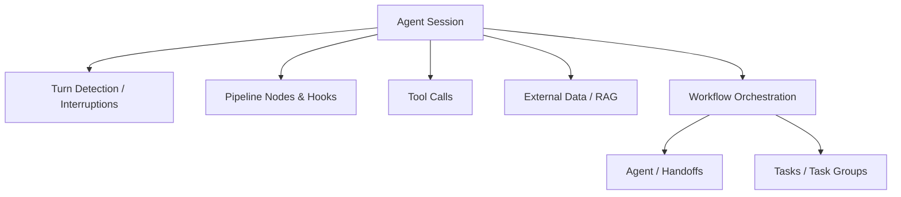
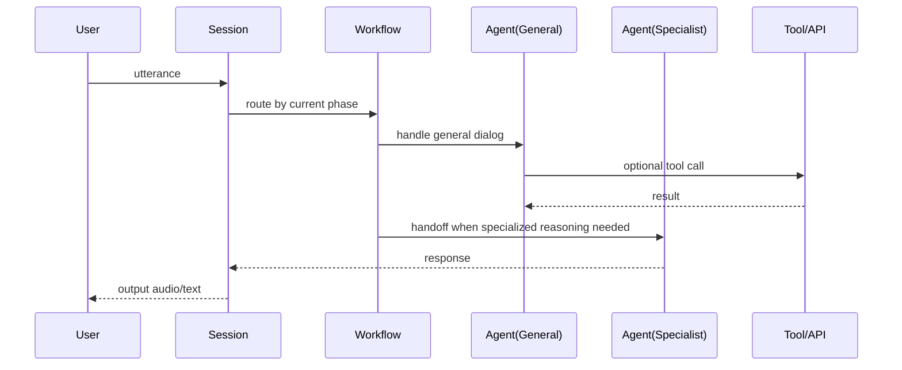

# Logic and Structure Overview

参照元: [[SourceNotes/LiveKit_Agents_Documentation.md|LiveKit Agents Documentation]]
ロードマップ: [[StructureNotes/LiveKit_Agent_Framework_学習ロードマップ.md|学習ロードマップ]]

## What（何についてか）

Logic and Structure Overview は、LiveKit Agents におけるアプリケーション設計の分解単位を定義する章である。

対象は、Session を中心とした実行構造、Workflow による進行設計、Task と Tool による処理責務、Pipeline 拡張点、Turn 制御、Agent 間ハンドオフ、外部データ統合までを含む。

## Why（なぜ必要か）

音声エージェントを単一巨大ロジックとして実装すると、会話状態・外部連携・割り込み処理・役割分担が密結合し、変更時の破壊範囲が広がる。

LiveKit はこの問題を回避するため、責務を明示的に分解し、モジュール単位で再利用・差し替え・検証できる構造を提供する。

Koeiの理解として重要なのは、Session と Workflow の関係である。
Session は実行を保持する器であり、Workflow はその器の中で会話や処理をどう進行させるかの設計である。

## How（どう動くか）

全体の中心は Session であり、入出力パイプライン、ライフサイクル、状態を管理する。
Workflow は Session 内での進行方針を定義し、必要に応じて Task 群や複数 Agent を組み合わせる。

この構造により、同一 Session 内で進行段階を切り替える設計が可能になる。
たとえば「ヒアリング → 本人確認 → 実行確認」のような段階管理を、Workflow 側で明示的に持てる。

## Session と Workflow の整理

Session は「どこで動くか」を担い、Workflow は「どう進めるか」を担う。

この区別により、実行基盤（接続・パイプライン）と業務進行（段階遷移・役割分割）を独立して扱える。

Koeiの理解表現では、Session を舞台、Workflow を台本として捉えるのが適切である。
ただし Workflow はサブエージェントそのものではなく、サブエージェントや Task を組み合わせる進行設計である。

## コンポーネントの位置づけ

- Agent sessions: セッション実行の主オーケストレータ
- Tasks & task groups: 目的特化の処理ユニット（詳細は個別章）
- Workflows: 再利用可能な進行パターン
- Tool definition & use: LLM から外部機能を呼び出す拡張点
- Pipeline nodes & hooks: STT/LLM/TTS 処理点のカスタマイズ
- Turn detection & interruptions: 発話タイミングと割り込み制御
- Agents & handoffs: 役割分担と制御移譲
- External data & RAG: 外部知識統合

## Key Concepts

| 用語 | 説明 |
|---|---|
| Session | 入出力・状態・ライフサイクルを保持する実行コンテナ |
| Workflow | セッション内の進行手順を定義する設計単位 |
| Task | 目的特化の処理ユニット（型付き結果を返す） |
| Task Group | 複数タスクをまとめて進行管理する単位 |
| Handoff | 異なる Agent へ制御を移す仕組み |
| Pipeline Hook | STT/LLM/TTS の処理点へ差し込むカスタマイズ処理 |

## 一言まとめ

Logic & Structure は、音声エージェントを Session 中心の実行基盤と Workflow 中心の進行設計に分解し、Task・Tool・Handoff・外部データを組み合わせて複雑な会話処理を保守可能に実装するための設計レイヤーである。