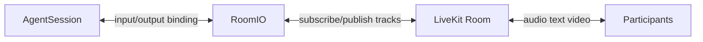
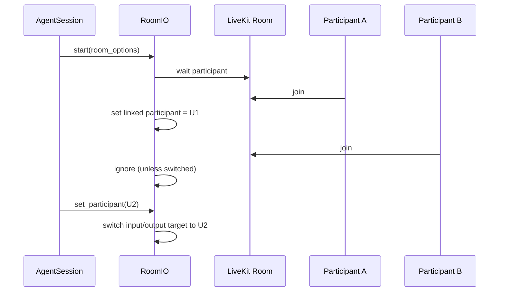
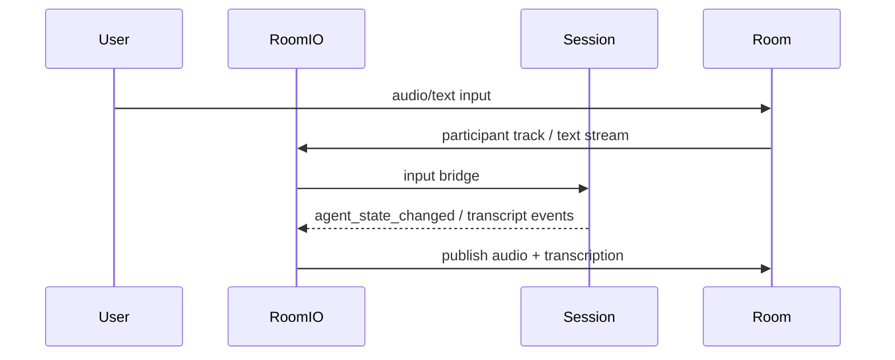

# RoomIO (Agent Session Context)

参照元: [[SourceNotes/LiveKit_Agents_Documentation.md|LiveKit Agents Documentation]]
関連ノート: [[LiteratureNotes/lit-202603071115-r8mn.md|Agent Session]]
ロードマップ: [[StructureNotes/LiveKit_Agent_Framework_学習ロードマップ.md|学習ロードマップ]]

## What（何についてか）

RoomIO は AgentSession と LiveKit Room の間にある I/O ブリッジであり、
「誰の入力を受け、どの媒体でどう出力するか」を制御する実行レイヤーである。

AgentSession が会話ロジックの司令塔を担うのに対し、RoomIO はメディア配線と participant 連携を担当する。

## Why（なぜ必要か）

会話ロジック（推論・状態遷移）とメディア接続（track購読・publish）を同じ層に混在させると、
拡張・デバッグ・運用調整のコストが上がる。

RoomIO を分離することで、

- 会話制御（AgentSession）
- メディア配線（RoomIO）

を独立に調整できる。

とくに複数 participant 環境では、linked participant の選択と切替が品質を大きく左右するため、
この責務分離は実運用上の必須設計になる。

## How（どう動くか）

RoomIO は start 時に input/output ストリームを生成し、
Room イベントと Session イベントを購読して I/O を同期する。

## セッション単位と生成タイミング

RoomIO は「ストリームごと」ではなく「セッション単位」で扱う。

実装上は AgentSession.start() の流れで RoomIO が初期化され、
1つの AgentSession に対して1つの RoomIO インスタンスが配線責務を持つ。

## linked participant の制御

デフォルトでは最初に条件を満たした participant が linked participant になる。

明示指定・動的切替は以下で行える。

- RoomOptions.participant_identity で初期固定
- RoomIO.set_participant() で動的切替

## RoomOptions（Python）と挙動

### Top-level

- text_input（default: enabled）
  - False で text入力無効
  - TextInputOptions で callback差し替え
- audio_input（default: enabled）
  - False で音声入力無効
- video_input（default: disabled）
  - True で映像入力有効
- audio_output（default: enabled）
  - False で音声出力無効
- text_output（default: enabled）
  - False で transcription無効
- participant_kinds（default: SIP/STANDARD/CONNECTOR）
  - 自動リンク対象の participant 種別を制限
- participant_identity
  - linked participant を固定
- close_on_disconnect（default: True）
  - linked participant 離脱時に session終了
- delete_room_on_close（default: False, Python）
  - session終了時に room を即削除

### AudioInputOptions

- sample_rate, num_channels, frame_size_ms
  - 遅延・品質・計算量のトレードオフを調整
- noise_cancellation
  - 騒音環境で STT / turn detection 安定化
- pre_connect_audio（default: True）
  - 接続前音声の取りこぼし軽減
- pre_connect_audio_timeout（default: 3.0）
  - pre-connect待機時間の上限

### TextInputOptions

- text_input_cb
  - デフォルトは `interrupt -> generate_reply(user_input=...)`
  - 独自コマンド分岐やモード制御に差し替え可能

### AudioOutputOptions

- sample_rate, num_channels
  - 出力品質と帯域調整
- track_publish_options
  - publish属性調整
- track_name（default: roomio_audio）
  - クライアント側トラック識別を容易化

### TextOutputOptions

- sync_transcription
  - Falseで即時表示、Trueで音声同期
- transcription_speed_factor
  - 同期速度補正
- next_in_chain
  - 追加のTextOutputへ連結可能

## State / Event と RoomIO の関係

RoomIO は Session の state/event を Room 側へ反映・橋渡しする。

- agent_state_changed を participant attributes に反映
- user_input_transcribed を transcription出力へ中継
- close でI/O cleanupを実行

## Pythonコードベースで見える設計意図

`livekit-agents/livekit/agents/voice/room_io/room_io.py` と
`.../room_io/types.py` から読み取れる要点:

- RoomIO.start() で I/O生成とイベント購読を一括初期化
- set_participant() で audio/video/transcription の対象をまとめて切替
- close_on_disconnect 条件で session を安全に close へ遷移
- TranscriptSynchronizer で audio と transcription の同期を担保
- RoomInputOptions/RoomOutputOptions は deprecated で、RoomOptions 統合が推奨

## 運用ガイド（最小）

- まずは default 構成（audio in/out + text out）で開始
- 複数participantで混線するなら participant_identity を明示
- 騒音環境は noise_cancellation を有効化
- 字幕運用を重視するなら sync_transcription を有効化して速度補正

## Key Concepts

| 用語 | 説明 |
|---|---|
| RoomIO | AgentSession と LiveKit Room 間の I/O ブリッジ |
| linked participant | エージェントが対話対象として紐づく participant |
| RoomOptions | RoomIO の入出力・participant管理・cleanup設定 |
| close_on_disconnect | linked participant 離脱時の session自動終了設定 |
| TranscriptSynchronizer | 音声出力と字幕出力の同期制御コンポーネント |

## 一言まとめ

RoomIO は、会話ロジックそのものではなく、会話を成立させるメディア接続と participant 制御を担う実行インフラ層であり、
AgentSession と分離して設計することで実装の見通しと運用品質を同時に高められる。