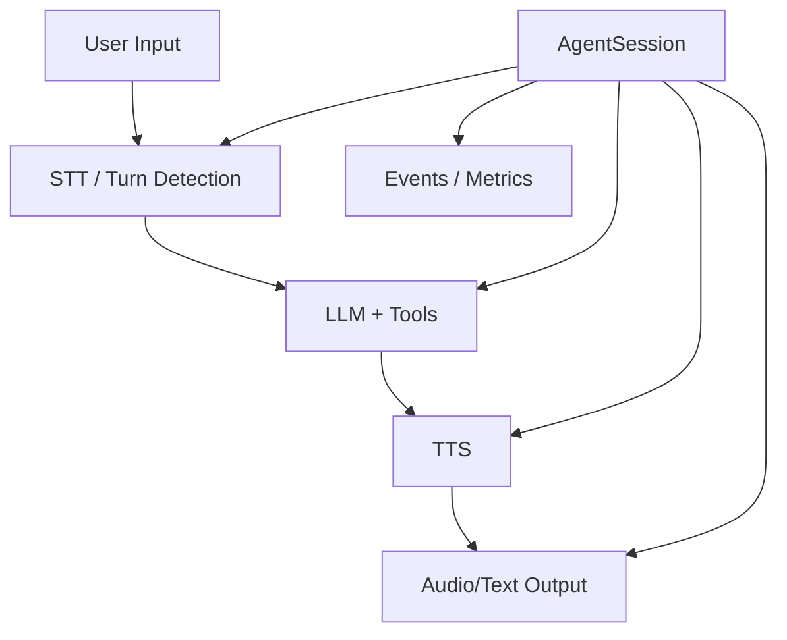
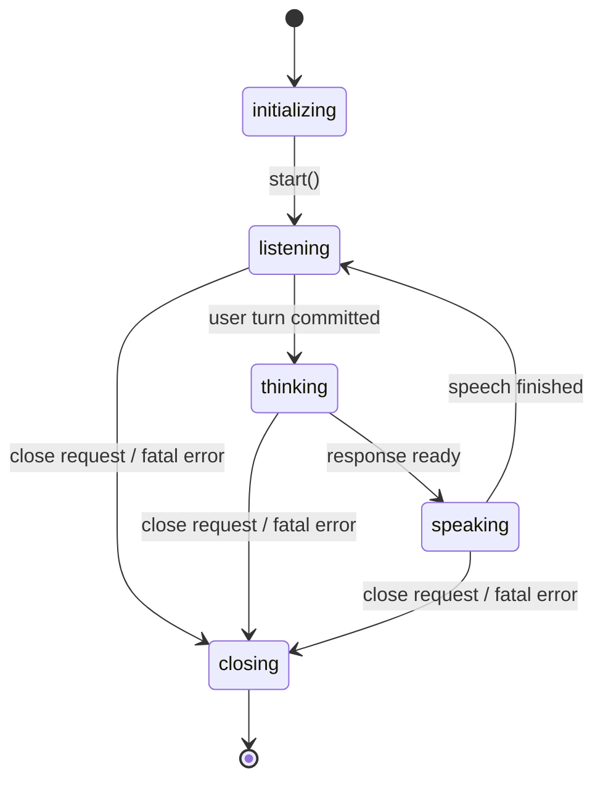
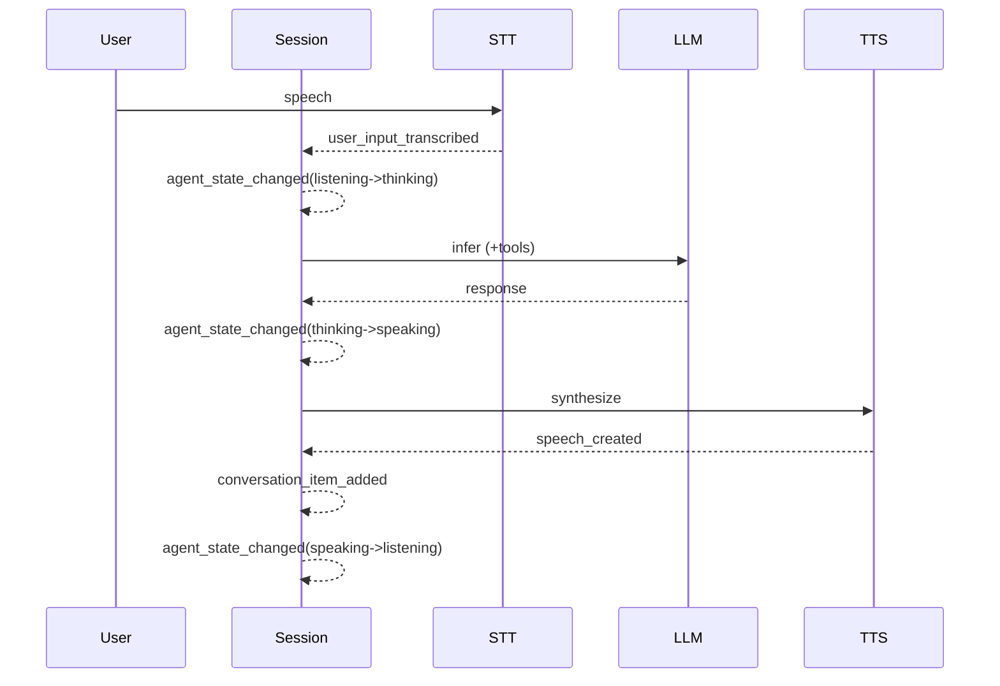
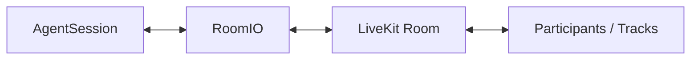

# Agent Session

参照元: [[SourceNotes/LiveKit_Agents_Documentation.md|LiveKit Agents Documentation]]
ロードマップ: [[StructureNotes/LiveKit_Agent_Framework_学習ロードマップ.md|学習ロードマップ]]

## What（何についてか）

AgentSession は、LiveKit Agents における音声 AI アプリの主オーケストレータである。

ユーザー入力の収集、STT/LLM/TTS パイプライン制御、応答生成、出力配信、観測イベント発火を一貫して管理する。

この章での「Session」は概念名であり、SDK 上の具体クラス名である AgentSession と同義で扱う。

## Why（なぜ必要か）

音声エージェント実装では、会話進行、メディア I/O、状態遷移、割り込み、外部機能呼び出しが同時に発生する。

これらを単一ロジックに混在させると、挙動の再現性と保守性が急速に低下する。

AgentSession は、実行制御を集中管理することで、
会話品質（応答性）、運用品質（可観測性）、実装品質（責務分離）を同時に成立させるための基盤になる。

## How（どう動くか）

Session は上記パイプラインの実行順序と状態を制御し、
必要に応じて tool 実行、割り込み処理、participant 管理を行う。

## Lifecycle と State

AgentSession は概ね以下のライフサイクルを辿る。

- Initializing
- Starting
- Running
- Closing

Running 中に、agent state は `listening` / `thinking` / `speaking` を遷移する。
user state は VAD をもとに `speaking` / `listening` / `away` を遷移する。

## Event と State の関係（重要）

State は現在地、Event は発生履歴である。

- State: 制御分岐や UI 表示に使う
- Event: 観測・分析・監査・トラブルシュートに使う

代表イベント:
- `agent_state_changed`
- `user_state_changed`
- `user_input_transcribed`
- `conversation_item_added`
- `function_tools_executed`
- `metrics_collected`
- `speech_created`
- `close`

## Session options の要点

### Tools and capabilities

- `tools`, `mcp_servers`, `max_tool_steps` で外部機能連携を制御する。
- `ivr_detection` は telephony/IVR 文脈を検出して DTMF 連携を扱いやすくするためのオプションである。

### User interaction

- `user_away_timeout`: 無応答を away 判定する閾値。
- `min_consecutive_speech_delay`: エージェントが連続発話する際の最小間隔。過密な連投を抑え、会話テンポを安定させる。

### Text processing

- `tts_text_transforms`: TTS 前処理（例: markdown/emoji除去）で発話品質を安定化。
- `use_tts_aligned_transcript`: TTS が返すタイムアライン済み transcript を利用し、字幕同期や途中中断位置の整合性を向上させる。

補足として、タイムアライン済み transcript は VTT と同じ目的領域（発話テキストと時間の対応）を持つ。形式は実装依存だが、用途はほぼ同一である。

## rtc_session options の意義

`@server.rtc_session(...)` で設定する値は、ジョブ受理時の実行ポリシーを明示する。

- `agent_name`: 明示 dispatch 対象名
- `type`: インスタンス粒度（ROOM / PUBLISHER）
- `on_session_end`: セッション終了後処理
- `on_request`: ジョブ受理可否判定

特に `type` はスケール単位を決める重要設定であり、
ROOM は「1 room = 1 agent instance」、PUBLISHER は「1 publisher = 1 agent instance」として負荷分散戦略を分けられる。

## RoomIO の位置づけ（概要）

RoomIO は AgentSession と LiveKit Room の橋渡し層である。

主な責務:
- linked participant の決定と切替
- 入力トラック（audio/text/video）の購読制御
- 出力トラックの配信制御
- room options に基づく I/O 振る舞い適用

RoomIO は後続章で詳細学習するが、現段階では「メディア配線責務を Session ロジックから分離する層」と理解すればよい。

## Key Concepts

| 用語 | 説明 |
|---|---|
| AgentSession | 音声AIアプリ全体の実行オーケストレータ |
| Agent State | `initializing / listening / thinking / speaking` の状態集合 |
| User State | `speaking / listening / away` の状態集合 |
| Event | 状態変化や処理完了を通知する時系列シグナル |
| ivr_detection | IVR/DTMF を伴う電話対話での補助機能 |
| min_consecutive_speech_delay | 連続発話間隔を制御し会話テンポを整えるパラメータ |
| tts_aligned_transcript | 発話テキストと時間情報が対応づけられた transcript |
| RoomIO | Session と Room の I/O 橋渡し層 |

## 一言まとめ

AgentSession は、会話パイプライン制御・状態遷移・イベント観測・I/O 接続を統合する司令塔であり、State を制御に、Event を観測に分離して設計することで、音声エージェントの実運用品質を確保できる。