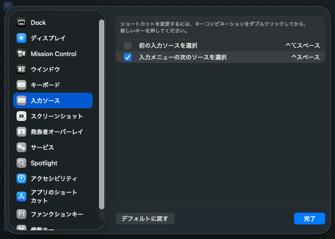

## 概要

MacOSでIME（Input Method Editor）のキーボードショートカットが正常に動作しない場合のトラブルシューティング方法をまとめる。

## 問題パターン

### Tahoe での症状

Ctrl+Space（またはCommand+Space）でIMEを切り替えようとすると：
- アイコン上は英語と日本語が切り替わる
- キーを離した瞬間に元のモードに戻る
- 結局入力モードが切り替わらない

この症状はApple Discussionsでも報告されている（[参考スレッド](https://discussionsjapan.apple.com/thread/256147156?sortBy=rank)）。

**環境**:
- Mac mini, Apple M1, Tahoe 26.1

## 解決方法

### キーボードショートカット設定の変更

**設定変更前の状態**:
- 「前の入力ソースを選択」にチェックが入っていた
- Ctrl+Spaceが設定されていた

**解決手順**:
1. システム設定 > キーボード > キーボードショートカット > 入力ソース
2. 「前の入力ソースを選択」のチェックを外す
3. 「入力メニューの次のソースを選択」にのみチェックを入れる
4. Ctrl+Space（または任意のキー）に設定

## 発見の経緯

たまたまこの解決方法にたどり着いた。

## 関連リソース

- [Apple Discussions - Tahoe にしてから Command+Space不具合](https://discussionsjapan.apple.com/thread/256147156?sortBy=rank)
- [解決方法の投稿](https://discussionsjapan.apple.com/thread/256147156?answerId=261768574122&sortBy=rank#261768574122)
