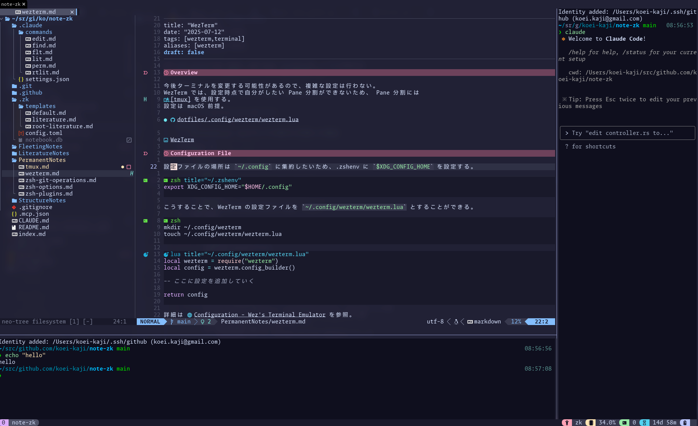

# Overview

今後ターミナルを変更する可能性があるので、複雑な設定は行わない。
WezTerm では、設定時点で自分がしたい Pane 分割ができないため、 Pane 分割には
[[PermanentNotes/tmux|tmux]] を使用する。
設定は macOS 前提。

- [dotfiles/.config/wezterm/wezterm.lua](https://github.com/koei-kaji/dotfiles/blob/ed9a134dec91748de136f20f8f8daab12473cc9f/.config/wezterm/wezterm.lua)



# Configuration File

設定ファイルの場所は `~/.config` に集約したいため、.zshenv に `$XDG_CONFIG_HOME` を設定する。

```zsh title="~/.zshenv"
export XDG_CONFIG_HOME="$HOME/.config"
```

こうすることで、WezTerm の設定ファイルを `~/.config/wezterm/wezterm.lua` とすることができる。

```zsh
mkdir ~/.config/wezterm
touch ~/.config/wezterm/wezterm.lua
```

```lua title="~/.config/wezterm/wezterm.lua"
local wezterm = require("wezterm")
local config = wezterm.config_builder()

-- ここに設定を追加していく

return config
```

詳細は [Configuration - Wez's Terminal Emulator](https://wezterm.org/config/files.html#quick-start) を参照。

# Settings

## Auto Reload

設定するたびに毎回 WezTerm の再起動は面倒なので、Auto reload が行われるようにする。

```lua title="~/.config/wezterm/wezterm.lua"
config.automatically_reload_config = true
```

## Command Shell

Terminal 起動時に [[PermanentNotes/tmux|tmux]] が起動するように設定する。

```lua title="~/.config/wezterm/wezterm.lua"
config.default_prog = {
  "/bin/zsh",
  "-c",
  "-l",
  "/opt/homebrew/bin/tmux",
}
```

## Window Size Initialization

起動時のウィンドウサイズが小さいので程よく大きくする。

```lua title="~/.config/wezterm/wezterm.lua"
config.initial_cols = 150
config.initial_rows = 50
```

## Padding

ウィンドウの余白は不要なので詰める。

```lua title="~/.config/wezterm/wezterm.lua"
config.window_padding = {
  left = 0,
  right = 0,
  top = 0,
  bottom = 0,
}
```

## Font

TODO: 本来は fallback font を設定しておくのが良さそう。

```lua title="~/.config/wezterm/wezterm.lua"
-- terminal font
config.font = wezterm.font("Moralerspace Argon NF")
config.font_size = 18.0

-- tab font
config.window_frame = {
  font = wezterm.font("Moralerspace Argon NF"),
  font_size = 15.0,
}
```

## Color Scheme

[Color Schemes - Wez's Terminal Emulator](https://wezterm.org/colorschemes/index.html) から好きなものを指定できる。

> [!WARNING]
> catppuccin, tmux, nvim を併用している場合、 colorscheme を指定することで逆に変なことになった（原因は正しく調べられていない）。
> wezterm で設定しなくても問題ないので、現在は設定していない。

## Background

少し透かして blur をかける。オシャレ。

```lua title="~/.config/wezterm/wezterm.lua"
config.window_background_opacity = 0.9
config.macos_window_background_blur = 30
```

## Titlebar

タイトルバーは不要なので非表示にする。サイズ変更はできても良いので `RESIZE` を指定。

```lua title="~/.config/wezterm/wezterm.lua"
config.window_decorations = "RESIZE"
```

設定できる項目は [window_decorations - Wez's Terminal Emulator](https://wezterm.org/config/lua/config/window_decorations.html?h=window_dec#window_decorations-title-resize) を参照。

## Confirmation When Closing Tabs

Ctrl + W を誤爆して Tab を即刻終了させてしまうことがあるので、 確認ダイアログが表示されるようにする。

```lua title="~/.config/wezterm/wezterm.lua"
config.skip_close_confirmation_for_processes_named = {}
```

## Title

イケてはいないがこれが最も簡単な方法で設定する。

`format-tab-title` を設定することで、tab に表示される文字列を変更できる。

Title にはカレントディレクトリを設定する。カレントディレクトリは zsh の preexec 経由で取得するので、 `.zshrc` に以下を記述。

```zsh title="~/.zshrc"
preexec() { print -Pn "\e]0;%1~\a" }
```

そのうえで、 `wezterm.lua` に以下を記述。必要なのは `""` 内の文字列だけなので、正規表現で抜き出す。

```lua title="~/.config/wezterm/wezterm.lua"
local function tab_title(tab_info)
  local title = tab_info.active_pane.title
  local extracted = title:match('"(.-)"')
  return extracted or title
end

wezterm.on("format-window-title", function(tab, pane, tabs, panes, config)
  return tab_title(tab)
end)

wezterm.on("format-tab-title", function(tab, tabs, panes, config, hover, max_width)
  return {
    { Text = tab_title(tab) },
  }
end)
```

Titlebar を非表示にしているが、Window switcher として [AltTab](https://alt-tab-macos.netlify.app/) を使用しているため `format-window-title` も同様に設定する。


# Appendix

- [Installation - Commentary of Dotfiles](https://coralpink.github.io/commentary/wezterm/installation.html#wezterm)
